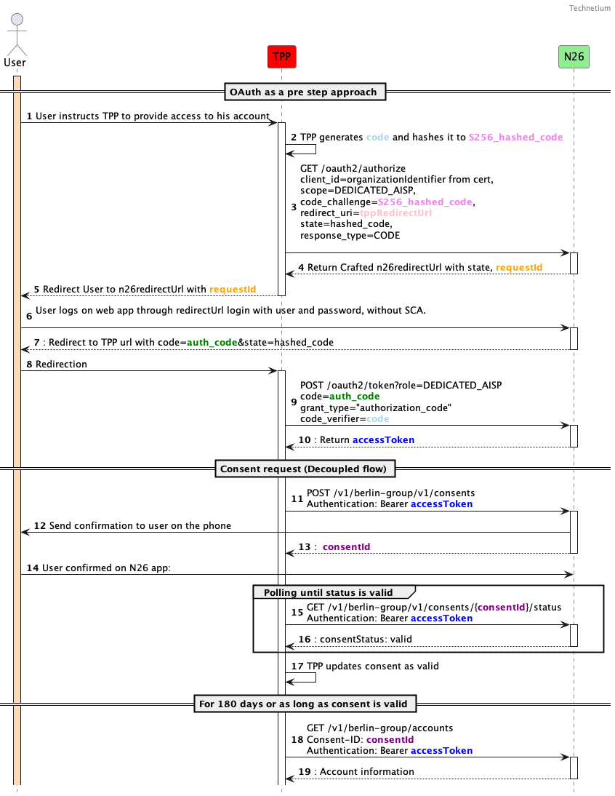

# N26 - PSD2 Dedicated Interface - AISP Access documentation

1. [General information](./dedicated-aisp.md#general-information)
2. [Access & Identification of TPP](./dedicated-aisp.md#access--identification-of-tpp)
3. [Support for this implementation on the Berlin Group API](./dedicated-aisp.md#support-for-this-implementation-on-the-berlin-group-api)
4. [OAuth as a Pre-step](./dedicated-aisp.md#oauth-as-a-pre-step)
5. [Validity of access & refresh tokens](./dedicated-aisp.md#validity-of-access--refresh-tokens)
6. [Authentication endpoints](./dedicated-aisp.md#authentication-endpoints)
7. [Consent endpoints](./dedicated-aisp.md#consent-endpoints)
8. [AIS endpoints](./dedicated-aisp.md#ais-endpoints)

## General information

Berlin Group Conformity : [Implementation Guidelines version 1.3.6](https://www.berlin-group.org/nextgenpsd2-downloads)

Authorisation protocol: [oAuth 2.0](https://oauth.net/2/)

Security layer: A valid QWAC Certificate for PSD2 is required to access the Berlin Group API. The official list of
QTSP is available on the [European Comission eIDAS Trusted List](https://webgate.ec.europa.eu/tl-browser/#/). For the N26 PSD2 Dedicated Interface API, the QWAC
Certificate must be issued from a production certificate authority.

> :information_source: Certificates can be renewed by making an API call **using the new certificate**, which will then be onboarded automatically.

## Access & Identification of TPP

### Base URL

```https://xs2a.tech26.de```

### Sandbox URL

```https://xs2a.tech26.de/sandbox```

### On-boarding of new TPPs

1. A TPP shall connect to the N26 PSD2 dedicated API by using an eIDAS valid certificate (QWAC) issued
2. N26 shall check the QWAC certificate in an automated way and allow the TPP to identify themselves with the subsequent API calls
3. As the result of the steps above, the TPP should be able to continue using the API without manual involvement from the N26 side

## Support for this implementation on the Berlin Group API


| **Service**                                                                    | **Support**                      |
| -------------------------------------------------------------------------------- | ---------------------------------- |
| Supported SCA Approaches                                                       | Decoupled (Oauth2 as a pre-step) |
| Maximum “frequency per day” supported by consents                            | 4                                |
| Consent confirmation timeout                                                   | 5 minutes                        |
| Consent scope: Global consent (allPsd2= allAccounts, allAccountsWithOwnerName) | Supported                        |
| Consent scope: availableAccounts= allAccounts                                  | Not Supported                    |
| Consent scope: availableAccountsWithBalances= allAccounts                      | Not Supported                    |
| Consent scope: Bank-offered consent                                            | Supported                        |
| Consent scope: Detailed consent                                                | Supported                        |
| Consents with/without Recurring indicator                                      | Supported                        |
| SCA Validity                                                                   | 180 days                          |
| Support of Signing Baskets                                                     | Not Supported                    |
| Support of Card accounts                                                       | Not Supported                    |
| Support of Multicurrency accounts                                              | Not Supported                    |
| Support of Account Owner extension                                             | Supported                        |
| Parameter withBalance=true                                                     | Not supported                    |
| Balance types supported                                                        | Expected                         |
| Transaction list retrieval through entryReferenceFrom                          | Not supported                    |
| Transaction list retrieval through deltaList                                   | Not supported                    |
| Transaction list format                                                        | application/json                 |
| Standing orders through bookingStatus=INFORMATION                              | Supported                        |
| App to app redirection                                                         | Not supported                    |

## OAuth as a Pre-step

OAuth2 is supported by this API through the authentication of a PSU in a pre-step, as per the diagram below:



## Validity of access & refresh tokens


|                | **Access Token**                                                                                                                                                                                                                                                                                                                                                | **Refresh Token**                                                                                                                                                                                                                                                                                                                                               |
| ---------------- | ----------------------------------------------------------------------------------------------------------------------------------------------------------------------------------------------------------------------------------------------------------------------------------------------------------------------------------------------------------------- | ----------------------------------------------------------------------------------------------------------------------------------------------------------------------------------------------------------------------------------------------------------------------------------------------------------------------------------------------------------------- |
| **Purpose**    | Access for API calls in **one session**                                                                                                                                                                                                                                                                                                                          | Generate new access tokens                                                                                                                                                                                                                                                                                                                                      |
| **How to get** | 1. Make a request to GET /oauth2/authorize providing a redirectUrl and a hashed code verifier1. Redirect users to n26 web page, where they will log in. If successful, page will be redirected to the URL provided on step 1, along with an auth Code1. Use the authCode along with the unhashed code verifier on POST /oauth2/tokenor1. Existing Refresh token | 1. Make a request to GET /oauth2/authorize providing a redirectUrl and a hashed code verifier1. Redirect users to n26 web page, where they will log in. If successful, page will be redirected to the URL provided on step 1, along with an auth Code1. Use the authCode along with the unhashed code verifier on POST /oauth2/tokenor1. Existing Refresh token |
| **Validity**   | 15 min                                                                                                                                                                                                                                                                                                                                                          | **One time usable** , but chain of refresh tokens is **valid for 180 days**                                                                                                                                                                                                                                                                                       |
| **Storage**    | NEVER                                                                                                                                                                                                                                                                                                                                                           | Yes, for 179 days (expiry needs to be stored on TPP)                                                                                                                                                                                                                                                                                                             |

> :information_source: **Refreshing refresh tokens**     
> The first refresh token has validity of 180 days, but is  **one-time usable**.
> With this refresh token, a new set of an access token and a refresh token can be requested.
> This new refresh token will maintain the initial 180 days validity.
> So, in summary, the chain of refresh tokens has a validity of 180 days.

> :information_source: **Refresh token getting close to expiry**   
> On day 179 the TPP should discard the refresh token and ask users for re-authentication.
> As highlighted above, the TPP should never store users' passwords.

> :warning: Access tokens are supposed to be used only for  **1 session (sequence of calls)** .    
> If users request a manual refresh, a new access token has to be requested **EVEN** if the original access token is still valid.
> For this reason the TPP should **NEVER** store the access token.

> :warning: The TPP should not use those access and refresh tokens on base URLs other than `xs2a.tech26.de`.

## Authentication endpoints

These endpoints are used to retrieve an access or refresh token for use with the /consents and /accounts endpoints.

Note: any values shown between curly braces should be taken as variables, while the ones not surrounded are to be read as literals.

### Initiate authorization

This begins the authorization process. Users should be redirected to the URL supplied in the response.

#### Sample request

```
GET /oauth2/authorize?client_id=PSDDE-BAFIN-000001&
                      scope=DEDICATED_AISP&
                      code_challenge=w6uP8Tcg6K2QR905Rms8iXTlksL6OD1KOWBxTK7wxPI&
                      redirect_uri=https://tpp.com/redirect&
                      response_type=CODE&
                      state=1fL1nn7m9a 
HTTP/1.1
```

Supported query parameters:


| **Name of parameter** | **Description**                                                                                                                                                                                                                                                                                                                                                                                                                                                                                                                                                                                                                                                                             |
| ----------------------- | --------------------------------------------------------------------------------------------------------------------------------------------------------------------------------------------------------------------------------------------------------------------------------------------------------------------------------------------------------------------------------------------------------------------------------------------------------------------------------------------------------------------------------------------------------------------------------------------------------------------------------------------------------------------------------------------- |
| client_id             | This should match the QWAC certificate’s organization identifier.This field may be obtained by running the following command on the QWAC certificate:*$ openssl x509 -in certificate.pem -noout -text                                                                                                                                                                                                                                                                                                                                                                                                                                                                                      |
| scope                 | Accepted value: “DEDICATED_AISP”. Mandatory field.                                                                                                                                                                                                                                                                                                                                                                                                                                                                                                                                                                                                                                        |
| code_challenge        | SHA256 hash of the code_verifier to be provided on POST /oauth2/token. Minimum size 43 characters, maximum 128. Should be Base-64 URL encoded, as per [https://tools.ietf.org/html/rfc7636#section-4.2](https://tools.ietf.org/html/rfc7636#section-4.2): `BASE64URL-ENCODE(SHA256(ASCII(code_verifier)))`. Please refer to [https://tonyxu-io.github.io/pkce-generator/](https://tonyxu-io.github.io/pkce-generator/) for sample values. So as an example, code_verifier should be set as “foobar” while code challenge would be “w6uP8Tcg6K2QR905Rms8iXTlksL6OD1KOWBxTK7wxPI”. Mandatory field. |
| redirect_uri          | URI to which users will be redirected back when the authorization process is completed. Mandatory field.                                                                                                                                                                                                                                                                                                                                                                                                                                                                                                                                                                                    |
| state                 | Random state string which should be returned on the query string when N26 redirects back, so the TPP can link the redirection to the original authorization request. Mandatory field.                                                                                                                                                                                                                                                                                                                                                                                                                                                                                                       |
| response_type         | Accepted value: “CODE”. Mandatory field.                                                                                                                                                                                                                                                                                                                                                                                                                                                                                                                                                                                                                                                  |

#### Sample Response

```
HTTP/1.1 302 Found
location: https://app.n26.com/open-banking?requestId=0daa152a-651a-4592-8542-47ff60799deb&state=1fL1nn7m9a&authType=XS2A
```

### Retrieve Token

When users are redirected back from the URL supplied in the previous request (step 7 of the sequence diagram), the following two query string parameters should be extracted and verified

* **state** - should match the state supplied in the initiate authorization request
* **code** - this is the authorization code which will be used to retrieve the token

As an example, if the TPP  provided `https://www.tpp.com/redirect` as redirect_uri, after the users have successfully logged in, the TPP can expect a redirection to the following URL:

`https://www.tpp.com/redirect?code=dbtF5AqOApjjSnNF5TK3w3gaEPdwtV2&state=1fL1nn7m9a`

Upon receiving this redirect, the TPP can make the following request can be made to retrieve the access and refresh tokens:

### Sample Request

```
POST    /oauth2/token?role=DEDICATED_AISP HTTP/1.1
Content-Type: application/x-www-form-urlencoded

grant_type=authorization_code&
code=dbtF5AqOApjjSnNF5TK3w3gaEPdwtV2&
code_verifier=foobar&
redirect_uri=https://tpp.com/redirect
```

Supported query parameters:


| **Name of query parameter** | **Description**                                                                      |
| ----------------------------- | -------------------------------------------------------------------------------------- |
| role                        | Accepted value: “`DEDICATED_AISP`” to generate a AISP-only token. Mandatory field. |

Supported form parameters:


| **Name of parameter** | **Description**                                                                                                                                |
| ----------------------- | ------------------------------------------------------------------------------------------------------------------------------------------------ |
| grant_type            | Accepted value: “authorization_code”. Mandatory parameter.                                                                                   |
| code                  | The authorization code as returned by N26 as a parameter (“code”) on the redirect URL (step 7 of the sequence diagram). Mandatory parameter. |
| code_verifier         | Value of the code verifier; should match hashed code challenge from `GET /oauth2/authorize` request. Mandatory parameter.                        |
| redirect_uri          | The same redirect URI that was provided to the `GET /oauth2/authorize` request. Optional parameter.                                              |

#### Response

##### Successful

```
HTTP/1.1 200 OK
{
    "access_token": "{{access_token}}",
    "token_type": "bearer",
    "refresh_token": "{{refresh_token}}",
    "expires_in": {{expires_in_seconds}}
}
```

##### TPP has provided the wrong authorization code or code verifier

```
HTTP/1.1 400 Bad Request
{
    "userMessage": {
        "title": "Error",
        "detail": "Please try again later."
    },
    "error_description": "Bad Request",
    "detail": "Bad Request",
    "type": "invalid_request",
    "error": "invalid_request",
    "title": "invalid_request",
    "status": 400
}
```

### Refresh Token

When an access_token has expired, a TPP can request a new one by making use of the refresh token request, which will invalidate the token used for this request and generate a new pair of access_token and refresh_token.

#### Request

```
POST    /oauth2/token?role=DEDICATED_AISP HTTP/1.1
Content-Type: application/x-www-form-urlencoded

grant_type=refresh_token&
refresh_token={{refresh_token}}
```

Supported query parameters:


| **Name of query parameter** | **Description**                                                                      |
| ----------------------------- | -------------------------------------------------------------------------------------- |
| role                        | Accepted value: “`DEDICATED_AISP`” to generate a AISP-only token. Mandatory field. |

Supported form parameters:


| **Name of parameter** | **Description**                                                               |
| ----------------------- | ------------------------------------------------------------------------------- |
| grant_type            | Accepted value: “refresh_token”. Mandatory parameter.                       |
| refresh_token         | The refresh token from the last POST /oauth2/token call. Mandatory parameter. |

#### Response

##### Successful

```
HTTP/1.1 200 OK
{
    "access_token": "{{access_token}}",
    "token_type": "bearer",
    "refresh_token": "{{refresh_token}}",
    "expires_in": {{expires_in_seconds}}
}
```

## Consent endpoints

Please use your QWAC certificate when calling for any Consent request on `xs2a.tech26.de`, along with a valid access 
token retrieved as per the oauth session.

### Create consent

#### Request (Global consent)

This is the only consent type that provides access to N26 spaces, since those do not have IBANs. For allPsd2, “allAccounts“ and “allAccountsWithOwnerName” options are supported. Recurring indicator is a mandatory parameter.

```
POST    /v1/berlin-group/v1/consents HTTP/1.1
Authorization: bearer {{access_token}}
Content-Type: application/json

{
  "access": {
      "allPsd2": "allAccounts"
  },
  "recurringIndicator": true,
  "validUntil": "2020-10-01",
  "frequencyPerDay": "4"
}
```

#### Request (consent by IBAN)

```
POST    /v1/berlin-group/v1/consents HTTP/1.1
Authorization: bearer {{access_token}}
Content-Type: application/json

{
  "access": {
    "accounts": [{
      "iban" : "DE73100110012629586632"
    }],
    "balances": [{
      "iban" :  "DE73100110012629586632"
    }],
    "transactions": [{
      "iban" :  "DE73100110012629586632"
    }]
  },
  "recurringIndicator": true,
  "validUntil": "2020-10-01",
  "frequencyPerDay": "4"
}
```

#### Request (bank offered consent)

```
POST    /v1/berlin-group/v1/consents HTTP/1.1
Authorization: bearer {{access_token}}
Content-Type: application/json

{
  "access": {
    "accounts": [],
    "balances": [],
    "transactions": []
  },
  "recurringIndicator": true,
  "validUntil": "2020-10-01",
  "frequencyPerDay": "4"
}
```

#### Response

```
aspsp-sca-approach: DECOUPLED

{
    "consentStatus": "received",
    "consentId": "fb44eb9c-d12f-4aef-90bd-726c47f2e864",
    "_links": {
        "status": {
            "href": "/v1/berlin-group/v1/consents/fb44eb9c-d12f-4aef-90bd-726c47f2e864/status"
        }
    }
}
```

### Get consent status

This endpoint is intended to be polled by the TPP to determine whether the users have confirmed the consent (as we are using the decoupled SCA approach). Please note that users have up to 5 minutes to confirm consent, and thus the time taken for the status to change is dependent on the user.

#### Request

```
GET    /v1/berlin-group/v1/consents/{{consentId}}/status HTTP/1.1
Authorization: bearer {{access_token}}
X-Request-ID: {{Unique UUID}}
Content-Type: application/json

```

#### Response

```
{
    "consentStatus": "received"
}
```

### Get consent

#### Request

```
GET    /v1/berlin-group/v1/consents/{{consentId}} HTTP/1.1
Authorization: bearer {{access_token}}
X-Request-ID: {{Unique UUID}}
Content-Type: application/json
```

#### Response

```
{
    "access": {
        "allPsd2": "allAccounts"
    },
    "recurringIndicator": true,
    "validUntil": "2020-11-01",
    "frequencyPerDay": 4,
    "lastActionDate": "2020-08-03",
    "consentStatus": "valid",
    "_links": {
        "account": {
            "href": "/v1/berlin-group/v1/accounts"
        }
    }
}
```

### Delete consent

#### Request

```
DELETE    /v1/berlin-group/v1/consents/{{consentId}} HTTP/1.1
Authorization: bearer {{access_token}}
X-Request-ID: {{Unique UUID}}
Content-Type: application/json
```

#### Response

```
HTTP/1.1 204 No Content
```

### Get authorisations

#### Request

```
GET    /v1/berlin-group/v1/consents/{{consentId}}/authorisations HTTP/1.1
Authorization: bearer {{access_token}}
X-Request-ID: {{Unique UUID}}
Content-Type: application/json
```

#### Response

```
{
    "authorisationIds": [
        "e93bf74e-9444-4a5e-8524-648d80848126"
    ]
}
```

### Get authorisation

#### Request

```
GET    /v1/berlin-group/v1/consents/{{consentId}}/authorisations/{{authorisationId}} HTTP/1.1
Authorization: bearer {{access_token}}
X-Request-ID: {{Unique UUID}}
Content-Type: application/json
```

#### Response

```
{
    "scaStatus": "finalised"
}
```

## AIS endpoints


### Read Account List
Please use your QWAC certificate when calling for any Accounts request on `xs2a.tech26.de`, along with a valid 
access token retrieved during [Oauth](./dedicated-aisp.md#validity-of-access--refresh-tokens) session.

#### Request

```
GET    /v1/berlin-group/v1/accounts HTTP/1.1
Authorization: bearer {{access_token}}
Consent-ID: {{consent_id}}
X-Request-ID: {{Unique UUID}}
PSU-IP-Address: {{Users'IP if they are present}}
Content-Type: application/json
```

* withBalance parameter is currently not supported.

#### Response

Field Owner name is only supported if the consent is “allAccountsWithOwnerName”. If allPsd2 Consent is requested, accounts without IBANs may be returned, corresponding to the N26 Spaces.

```
X-Request-ID: {{Unique UUID}}
{
    "accounts": [
        {
            "resourceId": "54683c9e-1160-4bf8-9a18-5c0bda473fb1",
            "currency": "EUR",
            "product": "Space",
            "name": "Trip to Australia",
            "cashAccountType": "CACC",
            "status": "enabled",
            "usage": "PRIV",
            "ownerName": "Name of owner",
            "_links": {
                "balances": {
                    "href": "/v1/berlin-group/v1/accounts/54683c9e-1160-4bf8-9a18-5c0bda473fb1/balances"
                },
                "transactions": {
                    "href": "/v1/berlin-group/v1/accounts/54683c9e-1160-4bf8-9a18-5c0bda473fb1/transactions"
                }
            }
        },
        {
            "resourceId": "9ce689d3-d7ce-4159-9405-d6756d645564",
            "iban": "DE73100110012629586632",
            "currency": "EUR",
            "product": "Main Account",
            "name": "Main Account",
            "bic": "NTSBDEB1XXX",
            "cashAccountType": "CACC",
            "status": "enabled",
            "usage": "PRIV",
            "ownerName": "Name of owner",
            "_links": {
                "balances": {
                    "href": "/v1/berlin-group/v1/accounts/9ce689d3-d7ce-4159-9405-d6756d645564/balances"
                },
                "transactions": {
                    "href": "/v1/berlin-group/v1/accounts/9ce689d3-d7ce-4159-9405-d6756d645564/transactions"
                }
            }
        },
        {
            "resourceId": "5fc825d0-102c-4d1b-8bd1-871e26a58001",
            "currency": "EUR",
            "product": "Shared Space",
            "name": "shared space",
            "cashAccountType": "CACC",
            "status": "enabled",
            "usage": "PRIV",
            "ownerName": "Name of owner",
            "_links": {
                "balances": {
                    "href": "/v1/berlin-group/v1/accounts/5fc825d0-102c-4d1b-8bd1-871e26a58001/balances"
                },
                "transactions": {
                    "href": "/v1/berlin-group/v1/accounts/5fc825d0-102c-4d1b-8bd1-871e26a58001/transactions"
                }
            }
        }
    ]
}
```

### Read Account Details

#### Request

```
GET    /v1/berlin-group/v1/accounts/{{resourceId}} HTTP/1.1
Authorization: bearer {{access_token}}
Consent-ID: {{consent_id}}
X-Request-ID: {{Unique UUID}}
PSU-IP-Address: {{Users'IP if they are present}}
Content-Type: application/json
```

* withBalance parameter is currently not supported.

#### Response

Field Owner name is only supported if consent is “allAccountsWithOwnerName”. If allPsd2 Consent is requested, accounts without IBANs may be returned, corresponding to the N26 Spaces.

```
X-Request-ID: {{Unique UUID}}
{
    "account": {
        "resourceId": "9ce689d3-d7ce-4159-9405-d6756d645564",
        "iban": "DE73100110012629586632",
        "currency": "EUR",
        "product": "Main Account",
        "name": "Main Account",
        "bic": "NTSBDEB1XXX",
        "cashAccountType": "CACC",
        "status": "enabled",
        "usage": "PRIV",
        "ownerName": "Name of owner",
        "_links": {
            "balances": {
                "href": "/v1/berlin-group/v1/accounts/9ce689d3-d7ce-4159-9405-d6756d645564/balances"
            },
            "transactions": {
                "href": "/v1/berlin-group/v1/accounts/9ce689d3-d7ce-4159-9405-d6756d645564/transactions"
            }
        }
    }
}
```

### Read Balance

#### Request

```
GET    /v1/berlin-group/v1/accounts/{{resourceId}}/balances HTTP/1.1
Authorization: bearer {{access_token}}
Consent-ID: {{consent_id}}
X-Request-ID: {{Unique UUID}}
PSU-IP-Address: {{Users'IP if they are present}}
Content-Type: application/json
```

#### Response

```
X-Request-ID: UUID

{
    "balances": [
        {
            "balanceType": "expected",
            "balanceAmount": {
                "amount": "55.55",
                "currency": "EUR"
            },
            "lastChangeDateTime": "2020-07-30T15:59:20.162Z"
        }
    ],
    "account": {
        "iban": "DE73100110012629586632"
    }
}
```

### Read Transaction List

Generally, GET /transactions requests are limited to a period of 90 days from the time the request is made. The only exception to this limitation, applies during the first 15 minutes of an AIS consent lifecycle. In this time period, any GET /transactions request made will not be limited. Moreover, requests made without specifying dateFrom and dateTo will return all transactions made since the account was created. After this time period, the above limitation will apply, and any requests trying to retrieve transactions older than 90 days will be rejected.

The list of transactions is returned in reverse chronological order, therefore newer transactions are listed first.

#### Request

```
GET    /v1/berlin-group/v1/accounts/{{resourceId}}/transactions HTTP/1.1
Authorization: bearer {{access_token}}
Consent-ID: {{consent_id}}
X-Request-ID: {{Unique UUID}}
PSU-IP-Address: {{Users'IP if they are present}}
Content-Type: application/json
```

* Query parameter “bookingStatus” is supported with values “booked” and “information” (“pending” and “both“ are not supported from 14th March 2022)
* Query parameters “dateFrom” and “dateTo” are supported when “bookingStatus” is not “information“
* Query parameter “withBalance”  is currently not supported.
* Query parameter “deltaList” is currently not supported.
* Pagination through “_links”  is currently not supported.

#### Response

```
X-Request-ID: UUID

{
    "account": {
        "iban": "DE73100110012629586632"
    },
    "transactions": {
        "booked": [
            {
                "transactionId": "7f9da399-8c53-4c68-b43c-c7e22a0c70d2",
                "creditorName": "User SEPA",
                "creditorAccount": {
                    "iban": "DE43100110012620287103"
                },
                "transactionAmount": {
                    "amount": "-20.0",
                    "currency": "EUR"
                },
                "bookingDate": "2020-07-22",
                "valueDate": "2020-07-22",
                "remittanceInformationUnstructuredArray":["Payback for lunch"],
                "remittanceInformationUnstructured":"Payback for lunch",
                "bankTransactionCode": "PMNT-ICDT-ESCT"
            },
            {
                "transactionId":"df0fed01-f949-4909-88c3-f1c01d2972ca",
                "debtorName":"User SEPA 2",
                "debtorAccount":{"iban":"DE65100110011234567890"},
                "transactionAmount": {
                    "amount":"22.0",
                    "currency":"EUR"
                },
                "bookingDate":"2020-07-20",
                "valueDate":"2020-07-20",
                "remittanceInformationUnstructuredArray":["Payback for drinks"],
                "remittanceInformationUnstructured":"Payback for drinks",
                "bankTransactionCode":"PMNT-RCDT-ESCT"
            },
            {
              "transactionId": "8943aefb-ec2b-46fa-8a38-dc264af13eb5",
              "additionalInformation":"67d507fd-c9e7-4d43-a799-103d37da65db",        
              "creditorName": "Merchant A",
              "transactionAmount": {
                "amount": "-9.50",
                "currency": "EUR"
              },
              "bookingDate": "2022-07-15",
              "valueDate": "2022-07-15",
              "remittanceInformationUnstructuredArray":["-"],
              "remittanceInformationUnstructured":"-",
              "bankTransactionCode": "PMNT-CCRD-POSD"
            },
            {
                "transactionId": "7f9da399-8c53-4c68-b43c-c7e22a0c70d2",
                "creditorName": "Merchant B",
                "creditorAccount": {
                    "iban": "DE43100110012620287103"
                },
                "transactionAmount": {
                    "amount": "-7.99",
                    "currency": "EUR"
                },
                "bookingDate": "2022-07-05",
                "valueDate": "2022-07-05",
                "remittanceInformationUnstructuredArray": ["Monthly fee"],
                "remittanceInformationUnstructured": "Monthly fee",
                "bankTransactionCode": "PMNT-IDDT-ESDD",
                "mandateId": "4ABK2252MNG98",
                "creditorId": "AB98ZZZ0000000000048"
            }
        ],
        "_links": {
            "account": {
                "href": "/v1/berlin-group/v1/accounts/9ce689d3-d7ce-4159-9405-d6756d645564"
            }
        }
    }
}
```
* additionalInformation is an ID that links different transactions related to the same purchase (specifically, card transactions)
* mandateId and creditorId are supported, for SEPA direct debit transactions only
* Both remittanceInformationUnstructuredArray and remittanceInformationUnstructured are provided, where applicable

### Read Transaction Details

#### Request

```
GET    /v1/berlin-group/v1/accounts/{{resourceId}}/transactions/{{transactionId}} HTTP/1.1
Authorization: bearer {{access_token}}
Consent-ID: {{consent_id}}
X-Request-ID: {{Unique UUID}}
PSU-IP-Address: {{Users'IP if they are present}}
Content-Type: application/json
```

* Query parameter “withBalance”  is currently not supported.
* Only transactions are supported, not standing orders.

#### Response

```
X-Request-ID: UUID

{
        "transactionId": "4b856f12-a75c-449f-8e71-69bd72947445",
        "additionalInformation":"5bccb1ed-67a4-48a1-8a88-3feec03a6952"
        "creditorName": "NOAPV21EQZYWG0NC0KNMMW",
        "transactionAmount": {
            "amount": "-1.0",
            "currency": "EUR"
        },
        "bookingDate": "2020-07-13",
        "valueDate": "2020-07-13",
        "bankTransactionCode": "PMNT-MCRD-UPCT"
    }
}
```
* mandateId and creditorId are supported, for SEPA direct debit transactions only (from 25th April 2022)
* Both remittanceInformationUnstructuredArray and remittanceInformationUnstructured are provided, where applicable (from 25th April 2022)

### Read Standing order List

#### Request

```
GET    /v1/berlin-group/v1/accounts/{{resourceId}}/transactions?bookingStatus=information HTTP/1.1
Authorization: bearer {{access_token}}
Consent-ID: {{consent_id}}
X-Request-ID: {{Unique UUID}}
PSU-IP-Address: {{Users'IP if they are present}}
Content-Type: application/json
```

* Query parameters “dateFrom” and “dateTo” are not supported for standing orders
* Pagination through “_links” is currently not supported.

#### Response

```
X-Request-ID: UUID

{
    "account": {
        "iban": "DE73100110012629586632"
    },
    "transactions": {
        "information": [
            {
                "creditorName": "Recipient",
                "creditorAccount": {
                    "iban": "DE12500105170648489890"
                },
                "transactionAmount": {
                    "amount": "1.00",
                    "currency": "EUR"
                },
                "remittanceInformationUnstructured": "Standing order",
                "additionalInformationStructured": {
                    "standingOrderDetails": {
                        "startDate": "2021-08-13",
                        "frequency": "MNTH"
                    }
                }
            }
        ],
        "_links": {
            "account": {
                "href": "/v1/berlin-group/v1/accounts/9ce689d3-d7ce-4159-9405-d6756d645564"
            }
        }
    }
}
```
