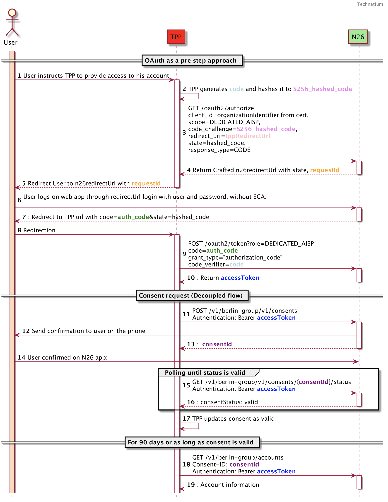

# N26 - PSD2 Dedicated Interface - PISP Access documentation

1. [General information](./dedicated-pisp.md#general-information)
2. [Access & Identification of TPP](./dedicated-pisp.md#access--identification-of-tpp)
3. [Support for this implementation on the Berlin Group API](./dedicated-pisp.md#support-for-this-implementation-on-the-berlin-group-api)
4. [OAuth as a Pre-step](./dedicated-pisp.md#oauth-as-a-pre-step)
5. [Authentication endpoints](./dedicated-pisp.md#authentication-endpoints)
6. [Payment endpoints](./dedicated-pisp.md#payment-endpoints)

## General information

Berlin Group Conformity : [Implementation Guidelines version 1.3.6](https://www.berlin-group.org/nextgenpsd2-downloads "https://www.berlin-group.org/nextgenpsd2-downloads")

Authorisation protocol: [oAuth 2.0](https://oauth.net/2/ "https://oauth.net/2/")

Security layer: A valid QWAC Certificate for PSD2 is required to access the Berlin Group API. The official list of QTSP is available on the [European Comission eIDAS Trusted List](https://webgate.ec.europa.eu/tl-browser/##/ "https://webgate.ec.europa.eu/tl-browser/##/"). For the N26 PSD2 Dedicated Interface API, the QWAC Certificate must be issued from a production certificate authority.

TPPs can renew their certificate by making an API call  **using the new certificate** , which will then be onboarded automatically.

## Access & Identification of TPP

### Base URL

`https://xs2a.tech26.de`
### Sandbox URL

`https://xs2a.tech26.de/sandbox`

### On-boarding of new TPPs

1. A TPP shall connect to the N26 PSD2 dedicated API by using an eIDAS valid certificate (QWAC) issued
2. N26 shall check the QWAC certificate in an automated way and allow the TPP to identify themselves  with the subsequent API calls
3. As the result of the steps above, the TPP should be able to continue using the API without manual involvement from the N26 side

## Support for this implementation on the Berlin Group API


| **Service**                  | **Support**                      |
| ------------------------------ | ---------------------------------- |
| Supported SCA Approaches     | Decoupled (Oauth2 as a pre-step) |
| SCA Validity                 | 20 minutes                       |
| Supported payment schemes    | SEPA Credit Transfers            |
| Support of Periodic payments | Not Supported                    |
| Support of Bulk payments     | Not Supported                    |
| fundsAvailable               | Not Supported                    |
| App to app redirection       | Not supported                    |

## OAuth as a Pre-step

OAuth2 is supported by this API through the authentication of a PSU in a pre-step, as per the diagram below:



### Validity of access token


|                | **Access Token**                                                                                                                                                                                                                                                                                                                     |
| ---------------- | -------------------------------------------------------------------------------------------------------------------------------------------------------------------------------------------------------------------------------------------------------------------------------------------------------------------------------------- |
| **Purpose**    | Access for API calls in**one session**                                                                                                                                                                                                                                                                                               |
| **How to get** | 1. Make a request to GET /oauth2/authorize providing a redirectUrl and a hashed code verifier1. Redirect users to n26 web page, where they will log in. If successful, page will be redirected to the URL provided on step 1, along with an auth Code1. Use the authCode along with the unhashed code verifier on POST /oauth2/token |
| **Validity**   | 20 min                                                                                                                                                                                                                                                                                                                               |
| **Storage**    | NEVER                                                                                                                                                                                                                                                                                                                                |

> :information_source: **PISP flow does not provide refresh tokens for security purposes**

> :warning: The TPP should not use those access tokens on base URLs other than `xs2a.tech26.de`.
Access tokens issued for PISP cannot be used for AISP flows.

## Authentication endpoints

These endpoints are used to retrieve an access or refresh token for use with the /consents and /accounts endpoints.

Note: any values shown between curly braces should be taken as variables, while the ones not surrounded are to be read as literals.

### Initiate authorization

This begins the authorization process. Users should be redirected to the URL supplied in the response.

#### Sample request

```
GET /oauth2/authorize?client_id=PSDDE-BAFIN-000001&
                      scope=DEDICATED_PISP&
                      code_challenge=w6uP8Tcg6K2QR905Rms8iXTlksL6OD1KOWBxTK7wxPI&
                      redirect_uri=https://tpp.com/redirect&
                      response_type=CODE&
                      state=1fL1nn7m9a 
HTTP/1.1
```

Supported query parameters:


| **Name of parameter** | **Description**                                                                                                                                                                                                                                                                                                                                                                                                                                                                                                                                                                                                                                                                             |
| ----------------------- | --------------------------------------------------------------------------------------------------------------------------------------------------------------------------------------------------------------------------------------------------------------------------------------------------------------------------------------------------------------------------------------------------------------------------------------------------------------------------------------------------------------------------------------------------------------------------------------------------------------------------------------------------------------------------------------------- |
| client_id             | This should match the QWAC certificate’s organization identifier.This field may be obtained by running the following command on the QWAC certificate:*$ openssl x509 -in certificate.pem -noout -text                                                                                                                                                                                                                                                                                                                                                                                                                                                                                      |
| scope                 | Accepted value: “DEDICATED_PISP”. Mandatory field.                                                                                                                                                                                                                                                                                                                                                                                                                                                                                                                                                                                                                                        |
| code_challenge        | SHA256 hash of the code_verifier to be provided on POST /oauth2/token. Minimum size 43 characters, maximum 128. Should be Base-64 URL encoded, as per[https://tools.ietf.org/html/rfc7636##section-4.2](https://tools.ietf.org/html/rfc7636##section-4.2 "https://tools.ietf.org/html/rfc7636##section-4.2").BASE64URL-ENCODE(SHA256(ASCII(code_verifier)))Please refer to[https://tonyxu-io.github.io/pkce-generator/](https://tonyxu-io.github.io/pkce-generator/ "https://tonyxu-io.github.io/pkce-generator/")for sample values.So as an example, code_verifier should be set as “foobar” while code challenge would be “w6uP8Tcg6K2QR905Rms8iXTlksL6OD1KOWBxTK7wxPI”.Mandatory field. |
| redirect_uri          | URI to which users will be redirected back when the authorization process is completed. Mandatory field.                                                                                                                                                                                                                                                                                                                                                                                                                                                                                                                                                                                    |
| state                 | Random state string which should be returned on the query string when N26 redirects back, so the TPP can link the redirection to the original authorization request. Mandatory field.                                                                                                                                                                                                                                                                                                                                                                                                                                                                                                       |
| response_type         | Accepted value: “CODE”. Mandatory field.                                                                                                                                                                                                                                                                                                                                                                                                                                                                                                                                                                                                                                                  |

#### Sample Response

```
HTTP/1.1 302 Found
location: https://app.n26.com/open-banking?requestId=0daa152a-651a-4592-8542-47ff60799deb&state=1fL1nn7m9a&authType=XS2A
```

### Retrieve Token

When users are redirected back from the URL supplied in the previous request (step 7 of the sequence diagram), the following two query string parameters should be extracted and verified

* **state** - should match the state supplied in the initiate authorization request
* **code** - this is the authorization code which will be used to retrieve the token

As an example, if the TPP  provided “https://www.tpp.com/redirect“ as redirect_uri, after the users have successfully logged in, the TPP can expect a redirection to the following URL:

`https://www.tpp.com/redirect?code=dbtF5AqOApjjSnNF5TK3w3gaEPdwtV2&state=1fL1nn7m9a`

Upon receiving this redirect, the TPP can make the following request can be made to retrieve the access and refresh tokens:

#### Sample Request

```
POST    /oauth2/token?role=DEDICATED_PISP HTTP/1.1
Content-Type: application/x-www-form-urlencoded

grant_type=authorization_code&
code=dbtF5AqOApjjSnNF5TK3w3gaEPdwtV2&
code_verifier=foobar&
redirect_uri=https://tpp.com/redirect
```

Supported query parameters:


| **Name of query parameter** | **Description**                                                                      |
| ----------------------------- | -------------------------------------------------------------------------------------- |
| role                        | Accepted value: “`DEDICATED_PISP`” to generate a PISP-only token. Mandatory field. |

Supported form parameters:


| **Name of parameter** | **Description**                                                                                                                                |
| ----------------------- | ------------------------------------------------------------------------------------------------------------------------------------------------ |
| grant_type            | Accepted value: “authorization_code”. Mandatory parameter.                                                                                   |
| code                  | The authorization code as returned by N26 as a parameter (“code”) on the redirect URL (step 7 of the sequence diagram). Mandatory parameter. |
| code_verifier         | Value of the code verifier; should match hashed code challenge from`GET /oauth2/authorize`request. Mandatory parameter.                        |
| redirect_uri          | The same redirect URI that was provided to the`GET /oauth2/authorize`request. Optional parameter.                                              |

#### Response

##### Successful

Note that no refresh tokens are provided for security purposes.

```
HTTP/1.1 200 OK
{
    "access_token": "{{access_token}}",
    "token_type": "bearer",
    "expires_in": {{expires_in_seconds}}
}
```

##### TPP has provided the wrong authorization code or code verifier

```
HTTP/1.1 400 Bad Request
{
    "userMessage": {
        "title": "Error",
        "detail": "Please try again later."
    },
    "error_description": "Bad Request",
    "detail": "Bad Request",
    "type": "invalid_request",
    "error": "invalid_request",
    "title": "invalid_request",
    "status": 400
}
```

## Payment endpoints

Please use your QWAC certificate when calling for any Payment request on `xs2a.tech26.de`, along with a valid access 
token retrieved as per the [Oauth](./dedicated-pisp.md#validity-of-access-token).

### Create payment

Currently the only accepted payment scheme supported is SEPA Credit Transfers.

```
POST    /v1/berlin-group/v1/payments/sepa-credit-transfers HTTP/1.1
Authorization: bearer {{access_token}}
Content-Type: application/json

{
    "instructedAmount": {
        "currency": "EUR", 
        "amount": "123.50"
    },
    "debtorAccount": {
        "iban": "DE40100100103307118608"
    },
    "creditorName": "Seller",
    "creditorAccount": {
        "iban": "DE02100100109307118603"
    },
    "remittanceInformationUnstructured": "Reference text"
}
```

> :warning: Allowed special characters in creditorName for N26 SEPA CT -  ( **:,.+?/** )

#### Response

```
aspsp-sca-approach: DECOUPLED

{
    "transactionStatus": "RCVD",
    "paymentId": "a4e7c6e3-ef2f-440c-ac0f-36dcafe4551c",
    "_links": {
        "status": {
            "href": "/v1/berlin-group/v1/payments/sepa-credit-transfers/a4e7c6e3-ef2f-440c-ac0f-36dcafe4551c/status"
        }
    }
}
```

### Get payment status

This endpoint is intended to be polled by the TPP to determine whether the users have confirmed the payment (as we are using the decoupled SCA approach).

Payment final status will be applied no later then **15 minutes. **

Statuses currently supported:


| **Status code** | **Description**                                                                                                                                                       |
| ----------------- | ----------------------------------------------------------------------------------------------------------------------------------------------------------------------- |
| RCVD            | Received. Initial status for a payment. A cerification has been sent to the user’s app.                                                                              |
| ACCP            | AcceptedCustomerProfile. User has confirmed the in-app certification and the payment has been initiated. Currently this is the final successful status for a payment. |
| RJCT            | Rejected. Status for payment when an in-app certification expired or was denied by the user.                                                                          |
| ACFC            | AcceptedFundsChecked.**Currently not supported** , but will be implemented in the future.                                                                             |
| ACSC            | AcceptedSettlementCompleted.**Currently not supported** , but will be implemented in the future.                                                                      |

#### Request

```
GET    /v1/berlin-group/v1/payments/sepa-credit-transfers/{{paymentstId}}/status HTTP/1.1
Authorization: bearer {{access_token}}
X-Request-ID: {{Unique UUID}}
Content-Type: application/json
```

#### Response

```
{
    "transactionStatus": "ACCP"
}
```

### Get payment

#### Request

```
GET    /v1/berlin-group/v1/payments/sepa-credit-transfers/{{paymentsId}} HTTP/1.1
Authorization: bearer {{access_token}}
X-Request-ID: {{Unique UUID}}
Content-Type: application/json
```

#### Response

```
{
  "debtorAccount": {
       "iban": "DE40100100103307118608"
  },
  "instructedAmount": {
       "amount":  0.12,
       "currency":  "EUR"},
  "creditorAccount":  {
       "iban": "DE96100110012627266269"
  },
  "creditorName": "Seller",
  "remittanceInformationUnstructured": "reference text",
  "transactionStatus": "ACCP"
}
```

### Delete payments

This endpoint is not supported.

### Get authorisations

#### Request

```
GET    /v1/berlin-group/v1/payments/sepa-credit-transfers/{{paymentId}}/authorisations HTTP/1.1
Authorization: bearer {{access_token}}
X-Request-ID: {{Unique UUID}}
Content-Type: application/json
```

#### Response

```
{
    "authorisationIds": [
        "e93bf74e-9444-4a5e-8524-648d80848126"
    ]
}
```

### Get authorisation

#### Request

```
GET    /v1/berlin-group/v1/payments/sepa-credit-transfers/{{paymentId}}/authorisations/{{authorisationId}} HTTP/1.1
Authorization: bearer {{access_token}}
X-Request-ID: {{Unique UUID}}
Content-Type: application/json
```

#### Response

```
{
    "scaStatus": "finalised"
}
```
[View as PDF](./assets/pdf/N26-PSD2-Dedicated-Interface-PISP-access-documentation.pdf)
