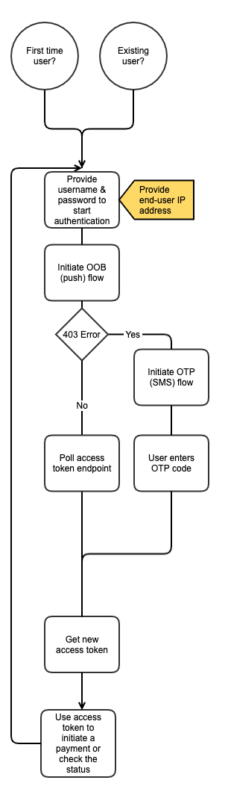

# PSD2 Fallback API - AISP access documentation

1. [Access & Identification of TPP](./fallback-aisp.md#access--identification-of-tpp)
    1. [Base URL](./fallback-aisp.md#base-url)
    2. [Characteristics of this solution](./fallback-aisp.md#characteristics-of-this-solution)
2. [User Authentication](./fallback-aisp.md#user-authentication)
    1. [Overview](./fallback-aisp.md#overview)
    2. [Start authentication with username & password](./fallback-aisp.md#start-authentication-with-username--password)
    3. [Continue authentication with Two-Step Certification (OOB) - Recommended](./fallback-aisp.md#continue-authentication-with-two-step-certification-oob---recommended)
    4. [Continue authentication with Two-Step SMS (OTP) - Not Recommended](./fallback-aisp.md#continue-authentication-with-two-step-sms-otp---not-recommended)
    5. [Get access and refresh tokens](./fallback-aisp.md#get-access-and-refresh-tokens)
    6. [Get new access & refresh token from valid refresh token](./fallback-aisp.md#get-new-access--refresh-token-from-valid-refresh-token)
3. [Account & User information](./fallback-aisp.md#account--user-information)
    1. [Overview](./fallback-aisp.md#overview-1)
    2. [Get user information](./fallback-aisp.md#get-user-information)
    3. [Get (Main) Account Information](./fallback-aisp.md#get-main-account-information)
    4. [Get (Spaces) Accounts Information](./fallback-aisp.md#get-spaces-accounts-information)
4. [Account Transactions](./fallback-aisp.md#account-transactions)
    1. [Overview](./fallback-aisp.md#overview-2)
    2. [Get (Main) Account Transactions](./fallback-aisp.md#get-main-account-transactions)
    3. [Get (Main) Account Transactions Details](./fallback-aisp.md#get-main-account-transactions-details)
    4. [Get (Spaces) Account Transactions](./fallback-aisp.md#get-spaces-account-transactions)
    

## Access & Identification of TPP

### Base URL

`https://aisp.tech26.de`

#### On-boarding of new TPPs

1. A TPP shall connect to the N26 PSD2 API by using an eIDAS valid certificate (QWAC) issued
2. N26 shall check the QWAC certificate in an automated way and allow the TPP to identify themselves  with the subsequent API calls
3. As the result of the steps above, the TPP should be able to continue using the API without manual involvement from the N26 side
> :information_source: Certificates can be renewed by making an API call **using the new certificate**, which will then
> be onboarded automatically.

### Characteristics of this solution

#### Identification of TPP through QWAC

Please use your QWAC certificate when calling for any request on `aisp.tech26.de`.

#### Data which needs to be stored & provided

Third parties will need to store following data in order to access API:

* refresh token with the date it will expire
* device token

Additionally, Third parties are obliged to send following data in every request to our API:

* device token : `device-token: {{device_token}}`
* real user ip: `x-tpp-userip<span id="1973177c-3174-44a7-bc31-8d826f00a77a" data-renderer-mark="true" data-mark-type="annotation" data-mark-annotation-type="inlineComment" data-id="1973177c-3174-44a7-bc31-8d826f00a77a">: {{userip}}</span>`
  * only when the request is initiated by the user
  * when from the TPP (background refresh), this is not needed

> :warning: TPPs should only pass the user ip when the call is initiated by the user.
> The TPP should not provide any IP that is not triggered by the user.

> :warning: TPP should provide a unique `device_token` per client/device connection.   `device_token` must be a valid UUID v4 as per RFC 4122.

##### Importance of `x-tpp-userip`

All calls initiated by the user (manual refresh or initial generation of access & refresh token) must include the IP address of the user in the `x-tpp-userip` header. From a technical point of view, providing this IP address** guarantees us to identify proper user calls** and to  **protect the integrity of our services** .

Since our Fallback API is based on our original API for our mobile and web apps, there are a lot of security measures built-in. Many of these security measures track the end-user IP addresses and prevent frequent calls from different IP addresses for the same user (amongst other features, that we do not disclose for security reasons). If a TPP doesn't provide an end-user’s IP address with API requests requiring IP specification, or tries to manipulate or obfuscate IP addresses, such cases will be treated in accordance to our established security policies applied to the original API.

> :warning: According to PSD2 (Level1) Art. 94 (1) we require the end-user IP to be specified with every end-user generated request. Monitoring end-user IPs on the N26 side is necessary to safeguard the prevention, investigation and detection of payment fraud. In case N26 security measures applied to the API detect unusual user-related activity, such cases will be processed in accordance with the established security policies, including (but not limited to) rate limiting, blocking request by IP and reporting such cases to the regulatory authorities.

#### Data which should not be stored  :warning:

As per Art 22 (1), (2b) and Art 33(5a) of [Directive (EU) 2015/2366 of the European Parliament and of the Council with regard to regulatory technical standards for strong customer authentication and common and secure open standards of communication](https://eur-lex.europa.eu/legal-content/EN/TXT/?uri=uriserv:OJ.L_.2018.069.01.0023.01.ENG&toc=OJ:L:2018:069:TOC##d1e1565-23-1 "https://eur-lex.europa.eu/legal-content/EN/TXT/?uri=uriserv:OJ.L_.2018.069.01.0023.01.ENG&toc=OJ:L:2018:069:TOC##d1e1565-23-1") TPP should **NOT store the password** of users!

> CHAPTER IV
>
> CONFIDENTIALITY AND INTEGRITY OF THE PAYMENT SERVICE USERS' PERSONALISED SECURITY CREDENTIALS
>
> Article 22
>
> Payment service providers shall ensure the confidentiality and integrity of the personalised security credentials of the payment service user, including authentication codes, during all phases of the authentication.
>
> For the purpose of paragraph 1, payment service providers shall ensure that each of the following requirements is met:
>
> a) […]
>
> b) personalised security credentials in data format, as well as cryptographic materials related to the encryption of the personalised security credentials are not stored in plain text;

> Section 2
>
> Specific requirements for the common and secure open standards of communication
>
> Article 33
>
> Contingency measures for a dedicated interface
>
> […]
>
> For this purpose, account servicing payment service providers shall ensure that the payment service providers referred to in Article 30(1) can be identified and can rely on the authentication procedures provided by the account servicing payment service provider to the payment service user. Where the payment service providers referred to in Article 30(1) make use of the interface referred to in paragraph 4 they shall:
>
> a) take the necessary measures to ensure that they do not access, store or process data for purposes other than for the provision of the service as requested by the payment service user;

> :warning: If we identify the TPP is doing this, we reserve the right to block those accesses.

#### Validity of access & refresh tokens


|                | **Access Token**                                                           | **Refresh Token**                                                          |
| ---------------- | ---------------------------------------------------------------------------- | ---------------------------------------------------------------------------- |
| **Purpose**    | Access for API calls in**one session**                                     | Generate new access tokens                                                 |
| **How to get** | 1. Email & password1.**Push**(OOB) or SMS (OTP)or1. Existing Refresh token | 1. Email & password1.**Push**(OOB) or SMS (OTP)or1. Existing Refresh token |
| **Validity**   | 15 min                                                                     | **One time usable** , but chain of refresh tokens is**valid for 90 days**  |
| **Storage**    | NEVER                                                                      | Yes, for 89 days (expiry needs to be stored on TPP)                        |

> :information_source: **Refreshing refresh tokens**
> The first refresh token has validity of 90 days, but is  **one-time usable** .
> With this refresh token, an access and a new refresh token can be requested.
> This new refresh token maintain the initial 90 days validity.
> So in summary the chain of refresh tokens has a validity of 90 days.

> :information_source: **Refresh getting close to expiry**
> On day 89 the TPP should discard the refresh token and ask the user re-authentication.
> As highlighted above the TPP should never store the password of the user.

> :warning: Access tokens are supposed to be used only for  **1 session (sequence of calls)** .
> If a user requests a manual refresh a new access token has to be requested **EVEN** if the original access token is still valid.
> For this reason the TPP should **NEVER** store the access token.

> :warning: The TPP should not use those access and refresh tokens on other base URLs than `aisp.tech26.de`.

> :x: If those policies above are not respected, there is no guarantee you will not be rate-limited.

## User Authentication

### Overview



### Start authentication with username & password

#### Request

```
POST /oauth2/token HTTP/1.1
Content-Type: application/x-www-form-urlencoded
device-token: {{device_token}}
x-tpp-userip: {{userip}}

username={{username}}&password={{password}}&grant_type=password
```

##### Parameters

`device_token` is a unique identifier of device. Has to be the same per installation.

For syncs from the backend, this has to be unique and persisted per user.

`userip` has be populated with the real user ip.

> :information_source: Only the headers mentioned here are necessary

#### Responses

##### Successful

```
HTTP/1.1 403 Forbidden
{
  "status": 403,
  "error": "mfa_required",
  "mfaToken": {{mfaToken}},
  "hostUrl": "{{hostUrl}}",
  "detail": "mfa_required",
  "userMessage": {
    "title": "MFA token is required",
    "detail": "MFA token is required"
  }
}
```

##### Parameters

###### mfaToken

`mfaToken` is unique token of this login try. If is required for the subsequent Authentication requests.

##### Invalid credentials/username does not exist

```
HTTP/1.1 400 Forbidden
{
  "error": "invalid_grant",
  "error_description": "Bad credentials",
  "status": 400,
  "detail": "Bad credentials",
  "userMessage": {
    "title": "Login failed",
    "detail": "Incorrect user name or password! Please, try again"
  }
}
```

##### User was rate-limited

```
HTTP/1.1 429 Too Many Requests
{
  "error": "too_many_requests",
  "error_description": "Too many log-in attempts. Please try again in 30 minutes.",
  "status": 429,
  "detail": "Too Many Requests",
  "userMessage": {
    "title": "Too Many Requests",
    "detail": "Too many log-in attempts. Please try again in 30 minutes."
  }
}
```

##### No x-tpp-userip header was provided

```
HTTP/1.1 451 Unavailable For Legal Reasons
{
  "error": "Oops!",
  "status": 451,
  "detail": "Please try again later.",
  "userMessage": {
    "title": "Oops!",
    "detail": "Please try again later."
   },
}
```

### Continue authentication with Two-Step Certification (OOB) - Recommended

#### Request

```
POST /api/mfa/challenge HTTP/1.1
Content-Type: application/json
device-token: {{device_token}}
x-tpp-userip: {{userip}}
 
{ 
   "mfaToken": "{{mfaToken}}",
   "challengeType": "oob"
}
```

#### Responses

##### Successful

```
HTTP/1.1 200 OK
{
    "challengeType": "oob"
}
```

User received a push notification with the request to authorise this connection.

##### Unsuccessful

In case `device_token` is incorrect or `mfa_token` is incorrect.

```
HTTP/1.1 400 Bad Request
{
  "error": "invalid_grant",
  "error_description": "Bad credentials",
  "status": 400,
  "detail": "Bad credentials",
  "userMessage": {
    "title": "Login failed",
    "detail": "Session has expired or is not valid! Please, try again"
  }
}
```

##### User does not have a paired device

```
HTTP/1.1 403 Forbidden
{
  "error": "invalid_state",
  "error_description": "Invalid state to start the challenge",
  "status": 403,
  "detail": "Invalid state to start the challenge",
  "userMessage": {
    "title": "Login failed",
    "detail": "Invalid state to start the challenge"
  }
}
```

In this case, please proceed to the OTP flow.

### Continue authentication with Two-Step SMS (OTP) - Not Recommended

Reasons why SMS is not recommended:

* SMS delivery rate is not 100%
* SMS delivery takes time
* We limit how many SMS a user can use
* Users might have changed the phone number and not informed us

#### Request

```
POST /api/mfa/challenge HTTP/1.1
Content-Type: application/json
device-token: {{device_token}}
x-tpp-userip: {{userip}}
 
{ 
   "mfaToken": "{{mfaToken}}",
   "challengeType": "otp"
}
```

#### Responses

##### Successful

```
HTTP/1.1 201 Created
{
    "challengeType": "otp",
    "remainingResendCodeCount": {{remainingResendCodeCount}},
    "waitingTimeInSeconds": {{waitingTimeInSeconds}},
    "obfuscatedPhoneNumber": "{{obfuscatedPhoneNumber}}"
}
```

An SMS was sent to the user with the request to authorise this connection.

###### Parameters

`remainingResendCodeCount` (int) - amount of remaining resend attempts

`waitingTimeInSeconds` (int) - amount of time the client needs to wait before the next SMS send request

`obfuscatedPhoneNumber` - the phone number where the SMS has been sent to, e.g. "+49******0285"

##### Successful resent the SMS

```
HTTP/1.1 200 Ok
{
    "challengeType": "otp",
    "remainingResendCodeCount": {{remainingResendCodeCount}},
    "waitingTimeInSeconds": {{waitingTimeInSeconds}},
    "obfuscatedPhoneNumber": "{{obfuscatedPhoneNumber}}"
}
```

An SMS was resent to the user with the request to authorise this connection.

###### Parameters

`remainingResendCodeCount` (int) - amount of remaining resend attempts

`waitingTimeInSeconds` (int) - amount of time the client needs to wait before the next SMS send request

`obfuscatedPhoneNumber` - the phone number where the SMS has been sent to, e.g. "+49******0285"

##### SMS sent successfully less than 30 seconds ago

```
HTTP/1.1 204 No content
```

##### Unsuccessful

In case `device_token` is incorrect or `mfa_token` is incorrect.

```
HTTP/1.1 400 Forbidden
{
  "error": "invalid_grant",
  "error_description": "Bad credentials",
  "status": 400,
  "detail": "Bad credentials",
  "userMessage": {
    "title": "Login failed",
    "detail": "Session has expired or is not valid! Please, try again"
  }
}
```

##### SMS retry limit is reached

```
HTTP/1.1 429 Too Many Requests
{
  "error": "too_many_sms",
  "error_description": "Too many SMS have been sent. Please try again in 1 day.",
  "status": 429,
  "detail": "Too Many SMS",
  "userMessage": {
    "title": "Too Many SMS",
    "detail": "Too many SMS have been sent. Please try again in 1 day."
  }
}
```

### Get access and refresh tokens

#### Request for `OOB`

```
POST /oauth2/token HTTP/1.1
Content-Type: application/x-www-form-urlencoded
device-token: {{device_token}}
x-tpp-userip: {{userip}}
 
mfaToken={{mfaToken}}&grant_type=mfa_oob
```

> :information_source: The TPP should poll this endpoint not more than every 2 seconds.
> After a successful, expired or unauthorized response the polling should stop.

#### Responses for `OOB`

##### Successful

```
HTTP/1.1 200 OK
{
    "access_token": "{{access_token}}",
    "token_type": "bearer",
    "refresh_token": "{{refresh_token}}",
    "expires_in": {{expires_in}},
    "scope": "trust",
    "host_url": "{{host_url}}"
}
```

##### User has not yet provided authorisation

```
HTTP/1.1 400 Bad Request
{
  "error": "authorization_pending",
  "error_description": "MFA token was not yet confirmed",
  "status": 400,
  "detail": "MFA token was not yet confirmed",
  "userMessage": {
    "title": "Login failed",
    "detail": "Authorisation request is not confirmed. Please, confirm it on your device and try again."
  }
}
```

#### Request for `OTP`

```
POST /oauth2/token HTTP/1.1
Content-Type: application/x-www-form-urlencoded
device-token: {{device_token}}
x-tpp-userip: {{userip}}
 
mfaToken={{mfaToken}}&otp={{otp}}&grant_type=mfa_otp
```

##### Parameters

`otp` is the one-time password that user will received as an SMS and has to enter in the flow.

#### Responses for`otp`

##### Successful

```
HTTP/1.1 200 OK
{
    "access_token": "{{access_token}}",
    "token_type": "bearer",
    "refresh_token": "{{refresh_token}}",
    "expires_in": {{expires_in}},
    "scope": "trust",
    "host_url": "{{host_url}}"
}
```

##### User has provided the wrong code

```
HTTP/1.1 400 Bad Request
{
  "error": "invalid_otp",
  "error_description": "OTP is invalid",
  "status": 400,
  "detail": "OTP is invalid",
  "userMessage": {
    "title": "Invalid code",
    "detail": "Provided code is invalid. Please, try again."
  }
}
```

##### Unsuccessful

If `device_token` is incorrect, `mfa_token` is incorrect or expired in 5 minutes.

```
HTTP/1.1 400 Bad Request
{
  "error": "invalid_grant",
  "error_description": "Bad credentials",
  "status": 400,
  "detail": "Bad credentials",
  "userMessage": {
    "title": "Login failed",
    "detail": "Session has expired or is not valid! Please, try again"
  }
}
```

##### Too many code attempts (SMS must be resent)

```
HTTP/1.1 429 Too Many Requests
{
  "error": "too_many_attempts",
  "error_description": "Amount of the attempts has been exceeded. Please resend the SMS.",
  "status": 429,
  "detail": "Amount of the attempts has been exceeded. Please resend the SMS.",
  "userMessage": {
    "title": "Too many attempts",
    "detail": "Amount of the attempts has been exceeded. Please resend the SMS."
  }
}
```

### Get new access & refresh token from valid refresh token

#### Request

```
POST /oauth2/token HTTP/1.1
Content-Type: application/x-www-form-urlencoded
device-token: {{device_token}}
 
refresh_token={{refresh_token}}&grant_type=refresh_token
```

##### Parameters

`device_token` is a unique identifier of device. Has to be the same per installation.

For syncs from the backend, this has to be unique and persisted per user.

`refresh_token` is the valid stored refresh token.

#### Responses

##### Successful

```
HTTP/1.1 200 OK
{
    "access_token": "{{access_token}}",
    "token_type": "bearer",
    "refresh_token": "{{refresh_token}}",
    "expires_in": {{expires_in}},
    "scope": "trust",
    "host_url": "{{host_url}}"
}
```

##### Parameters

`access_token` is the token which is needed for subsequent API calls

`refresh_token` is the new 1-time usable refresh token

`expires_in` is the expiration time of the new access token in seconds

##### Refresh token expired or used more than once

```
HTTP/1.1 401 Unauthorized
{
    "status": 401,
    "detail": "Refresh token not found!",
    "type": "invalid_grant",
    "userMessage": {
        "title": "error.oauth2.invalid_refresh_token.title",
        "detail": "error.oauth2.invalid_refresh_token.detail"
    },
    "error": "invalid_grant",
    "error_description": "Refresh token not found!"
}
```

> :warning: On a `401` response the TPP has to refresh tokens.    
**Note:**     
Receiving a `401` indicates that the usage of access and refresh tokens is not as defined in [Validity of access 
> &amp; refresh tokens](./fallback-aisp.md#validity-of-access--refresh-tokens).

## Account & User information

### Overview

#### Entities

`User` - the natural person, which is owner of the account. User information is provided via `/api/me`.

`(Primary) Account` - Main user account. Every user has only one main account. This is the checking account. Information is provided via `/api/accounts`.

`(Secondary) Accounts aka Spaces` - A user can have multiple secondary accounts . The primary account is included in this response as well. Information is provided via `/api/spaces` or `/api/v2/spaces` (if shared spaces also might be included).

### Get user information

#### Request

```
GET    /api/me HTTP/1.1
Authorization: bearer {{access_token}}
x-tpp-userip: {{userip}}
device-token: {{device_token}}
```

#### Response

```
{
    "id": "fdd2d3eb-f16f-4aa1-9292-eac88ee356d5",
    "email": "email@email.com",
    "firstName": "FirstName",
    "lastName": "LastName",
    "kycFirstName": "FirstKYCName",
    "kycLastName": "LastKYCName",
    "title": "",
    "gender": "MALE",
    "birthDate": -303609600000,
    "signupCompleted": false,
    "nationality": "DEU",
    "mobilePhoneNumber": "+49xxxxxxx2731",
    "shadowUserId": "8ddff18d-9442-4357-8d18-ca69f0062864",
    "transferWiseTermsAccepted": false,
    "idNowToken": null
}
```

### Get (Main) Account Information

#### Request

```
GET    /api/accounts HTTP/1.1
Authorization: bearer {{access_token}}
x-tpp-userip: {{userip}}
device-token: {{device_token}}
```

#### Response

```
{
      "id": "4badce07-0de0-420d-a648-d3ae3e2d54d5",
      "physicalBalance": null,
      "availableBalance": 1044970.94,
      "usableBalance": 1044970.94,
      "bankBalance": 1044970.94,
      "iban": "DE15100110012627633320",
      "bic": "NTSBDEB1XXX",
      "bankName": "N26 Bank",
      "seized": false,
      "currency": "EUR",
      "legalEntity": "EU",
      "users": [
          {
              "userId": "fdd2d3eb-f16f-4aa1-9292-eac88ee356d5",
              "userRole": "OWNER"
          }
      ],
      "externalId": {
          "iban": "DE15100110012627633320"
      }
}
```

### Get (Spaces) Accounts Information

#### Request

```
GET    /api/spaces HTTP/1.1
Authorization: bearer {{access_token}}
x-tpp-userip: {{userip}}
device-token: {{device_token}}
```

#### Response

```
{
    "totalBalance": 1044980.0,
    "visibleBalance": 1044980.0,
    "spaces": [
        {
            "id": "e7626455-9a7a-4097-94a4-303e5f975dbc",
            "accountId": "4badce07-0de0-420d-a648-d3ae3e2d54d5",
            "name": "Main Account",
            "imageUrl": "https://scdn.number26.de/spaces/default-images/account_cards.jpg?version=1",
            "backgroundImageUrl": "https://scdn.number26.de/spaces/background-images/account_cards_background.jpg?version=1",
            "balance": {
                "availableBalance": 1044970.94,
                "currency": "EUR"
            },
            "isPrimary": true,
            "isHiddenFromBalance": false,
            "isCardAttached": true,
            "isLocked": false
        },
        {
            "id": "a664b9fb-638b-4358-b796-ec4bbec51f5a",
            "accountId": "11d6b19c-23c9-41a9-b8a7-59a74c5716dc",
            "name": "1st 🚀 Rules",
            "imageUrl": "https://scdn.number26.de/spaces/default-images/occasion_christmas.jpg?version=1",
            "backgroundImageUrl": "https://scdn.number26.de/spaces/background-images/occasion_christmas_background.jpg?version=1",
            "balance": {
                "availableBalance": 0.01,
                "currency": "EUR"
            },
            "isPrimary": false,
            "isHiddenFromBalance": false,
            "isCardAttached": false,
            "isLocked": false
        },
        {
            "id": "6bf72c54-77f0-4935-bf29-5334b1bed855",
            "accountId": "c48b42f8-fcaf-42a8-a430-08ca93c61e6b",
            "name": "Review",
            "imageUrl": "https://scdn.number26.de/spaces/default-images/self_instrument.jpg?version=1",
            "backgroundImageUrl": "https://scdn.number26.de/spaces/background-images/self_instrument_background.jpg?version=1",
            "balance": {
                "availableBalance": 9.05,
                "currency": "EUR"
            },
            "isPrimary": false,
            "isHiddenFromBalance": false,
            "isCardAttached": false,
            "isLocked": false
        }
    ],
    "userFeatures": {
        "availableSpaces": 0,
        "canUpgrade": true
    }
}
```

## Account Transactions

### Overview

#### Entities

`(Primary) Account transactions` - Are all transactions done on the primary account of the user. Information is provided via `/api/smrt/transactions`.

`(Secondary) Accounts aka Spaces transactions` - Are all of the space <> space transactions of one account. For the primary it does not include the Bank transfers and card transactions. Information is provided via `/api/spaces`.

### Get (Main) Account Transactions

#### Request

```
GET    /api/smrt/transactions HTTP/1.1
Authorization: bearer {{access_token}}
x-tpp-userip: {{userip}}
device-token: {{device_token}}
```

##### Parameters

`limit` number of transactions, defaults to 20.

`lastId` the last transactionId, exclusive.

`from` from timestamp, Unixtime

`to` to timestamp, Unixtime

For instance:

```
GET /api/smrt/transactions?limit=20&lastId=c690c24d-9a19-4400-0001-6db5542c82d5&from=1570312800000&to=1570312800001
```

> :warning: The TPP should not request request more than 90 days of transactions if the **access token** was generated from a  **refresh token** , **only** if generated **through the SCA** flow with email + password  & OOB/OTP.

#### Response

```
[
  {
    "id": "b6255a9a-97bd-4453-b332-701ac576bd10",
    "userId": "fdd2d3eb-f16f-4aa1-9292-eac88ee356d5",
    "type": "PT",
    "amount": -5432.0,
    "currencyCode": "EUR",
    "originalAmount": -5432.0,
    "originalCurrency": "EUR",
    "exchangeRate": 1.0,
    "visibleTS": 1570705239000,
    "mcc": 6011,
    "mccGroup": 18,
    "recurring": false,
    "partnerAccountIsSepa": false,
    "accountId": "4badce07-0de0-420d-a648-d3ae3e2d54d5",
    "category": "micro-v2-atm",
    "cardId": "096b54f1-f9ca-4d7a-8e78-7b1cebd2edd0",
    "userCertified": 1570705240081,
    "pending": false,
    "transactionNature": "NORMAL",
    "transactionTerminal": "ATM",
    "createdTS": 1570705240090,
    "smartLinkId": "b6255a9a-97bd-4453-b332-701ac576bd10",
    "linkId": "b6255a9a-97bd-4453-b332-701ac576bd10",
    "confirmed": 1570705240081
  },
  {...}
]
```

### Get (Main) Account Transactions Details

#### Request

```
GET    api/smrt/transactions/{transactionId} HTTP/1.1
Authorization: bearer {{access_token}}
x-tpp-userip: {{userip}}
device-token: {{device_token}}
```

#### Response

```
{
    "id": "b6255a9a-97bd-4453-b332-701ac576bd10",
    "userId": "fdd2d3eb-f16f-4aa1-9292-eac88ee356d5",
    "type": "PT",
    "amount": -5432.0,
    "currencyCode": "EUR",
    "originalAmount": -5432.0,
    "originalCurrency": "EUR",
    "exchangeRate": 1.0,
    "visibleTS": 1570705239000,
    "mcc": 6011,
    "mccGroup": 18,
    "recurring": false,
    "partnerAccountIsSepa": false,
    "accountId": "4badce07-0de0-420d-a648-d3ae3e2d54d5",
    "category": "micro-v2-atm",
    "cardId": "096b54f1-f9ca-4d7a-8e78-7b1cebd2edd0",
    "userCertified": 1570705240081,
    "pending": false,
    "transactionNature": "NORMAL",
    "transactionTerminal": "ATM",
    "createdTS": 1570705240090,
    "smartLinkId": "b6255a9a-97bd-4453-b332-701ac576bd10",
    "linkId": "b6255a9a-97bd-4453-b332-701ac576bd10",
    "confirmed": 1570705240081
  }
```

### Get (Spaces) Account Transactions

#### Request

```
GET    /api/spaces/{ID}/transactions?size=10&beforeId={transaction_id} HTTP/1.1
Authorization: bearer {{access_token}}
x-tpp-userip: {{userip}}
device-token: {{device_token}}
```

##### Parameters

`size` (mandatory) int. Number of transactions.

`beforeId` (optional). UUID of last transactions fetched. Show transaction from this ID to the past.

#### Response

```
{
    "transactions": [
        {
            "id": "bc7170a7-725e-11e9-80f4-0242ac110004",
            "amount": -0.02,
            "currency": "EUR",
            "type": "DT",
            "displayText": "To Review",
            "referenceText": "Daily Rule",
            "time": 1557408682563
        },
        {...},
    ],
    "hasMore": true
}
```

[View as PDF](./assets/pdf/N26-PSD2-Fallback-Interface-AISP-access-documentation.pdf)
