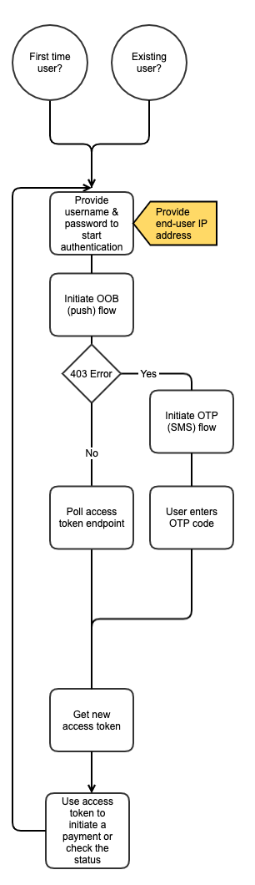

# PSD2 Fallback API - PISP access documentation

1. [Access & Identification of TPP](./fallback-pisp.md#access--identification-of-tpp)
    1. [Base URL](./fallback-pisp.md#base-url)
    2. [Characteristics of this solution](./fallback-pisp.md#characteristics-of-this-solution)
2. [User Authentication](./fallback-pisp.md#user-authentication)
    1. [Overview](./fallback-pisp.md#overview)
    2. [Step 1 - Start authentication with username & password](./fallback-pisp.md#step-1---start-authentication-with-username--password)
    3. [Step 2a - Recommended - Continue authentication with Two-Step Certification (OOB)](./fallback-pisp.md#step-2a---recommended---continue-authentication-with-two-step-certification-oob)
    4. [Step 2b - Not Recommended - Continue authentication with Two-Step SMS (OTP)](./fallback-pisp.md#step-2b---not-recommended---continue-authentication-with-two-step-sms-otp)
    5. [Step 3 - Get access token](./fallback-pisp.md#step-3---get-access-token)
3. [Payment Initiation](./fallback-pisp.md#payment-initiation)
    1. [Initiate SEPA (Credit Transfer) CT Transactions](./fallback-pisp.md#initiate-sepa-credit-transfer-ct-transactions)
    2. [Initiate SEPA Standing Order (Recurring/Future Payments)](./fallback-pisp.md#initiate-sepa-standing-order-recurringfuture-payments)
    3. [Initiate SEPA Instant Credit Transfer](./fallback-pisp.md#initiate-sepa-instant-transfer)
4. [Get Status of Initiated Transactions](./fallback-pisp.md#get-status-of-initiated-transactions)
   1. [Sepa Credit Transfer](./fallback-pisp.md#sepa-credit-transfer)
   2. [Sepa Instant Credit Transfer](./fallback-pisp.md#sepa-instant-credit-transfer)
   3. [Sepa Standing Order](./fallback-pisp.md#sepa-standing-order-recurringfuture-payments)
5. [Appendix A](./fallback-pisp.md#appendix-a)


## Access & Identification of TPP

### Base URL

`https://pisp.tech26.de`

#### On-boarding of new TPPs

1. A TPP shall connect to the N26 PSD2 API by using an eIDAS valid certificate (QWAC) issued
2. N26 shall check the QWAC certificate in an automated way and allow the TPP to identify themselves  with the subsequent API calls
3. As the result of the steps above, the TPP should be able to continue using the API without manual involvement from the N26 side
> :information_source: Certificates can be renewed by making an API call **using the new certificate**, which will then
> be onboarded automatically.

### Characteristics of this solution

#### Identification of TPP through QWAC

Please use your QWAC certificate when making any request on `pisp.tech26.de`.

#### Data which needs to be stored & provided

Third parties will need to store following data in order to access the API:

* device token

Additionally, Third parties are obliged to send following data in every request to our API:

* device token : `device-token: {{device_token}}`
* real user ip: `x-tpp-userip<span id="1973177c-3174-44a7-bc31-8d826f00a77a" data-renderer-mark="true" data-mark-type="annotation" data-mark-annotation-type="inlineComment" data-id="1973177c-3174-44a7-bc31-8d826f00a77a">: {{userip}}</span>`

> :warning: TPP should provide a unique `device_token` per client/device connection. `device_token` must be a valid UUID v4 as per RFC 4122.

##### Importance of `x-tpp-userip`

All payment initiation-related API calls must include the IP address of the end-user in the `x-tpp-userip` header. From a technical point of view, providing this IP address** guarantees us to identify proper user calls** and to  **protect the integrity of our services** .

Since our Fallback API is based on our original API for our mobile and web apps, there are a lot of security measures built-in. Many of these security measures track the end-user IP addresses and prevent frequent calls from different IP addresses for the same user (amongst other features, that we do not disclose for security reasons). If a TPP doesn't provide an end-user’s IP address with API requests requiring IP specification, or tries to manipulate or obfuscate IP addresses, such cases will be treated in accordance to our established security policies applied to the original API.

> :warning: According to PSD2 (Level1) Art. 94 (1) we require the end-user IP to be specified with every end-user generated request. Monitoring end-user IPs on the N26 side is necessary to safeguard the prevention, investigation and detection of payment fraud. In case N26 security measures applied to the API detect unusual user-related activity, such cases will be processed in accordance with the established security policies, including (but not limited to) rate limiting, blocking request by IP and reporting such cases to the regulatory authorities.

#### Data which should not be stored :warning:

As per Art 22 (1), (2b) and Art 33(5a) of [Directive (EU) 2015/2366 of the European Parliament and of the Council with regard to regulatory technical standards for strong customer authentication and common and secure open standards of communication](https://eur-lex.europa.eu/legal-content/EN/TXT/?uri=uriserv:OJ.L_.2018.069.01.0023.01.ENG&toc=OJ:L:2018:069:TOC##d1e1565-23-1 "https://eur-lex.europa.eu/legal-content/EN/TXT/?uri=uriserv:OJ.L_.2018.069.01.0023.01.ENG&toc=OJ:L:2018:069:TOC##d1e1565-23-1") TPPs should **NOT store passwords (incl. PINs)** of users!

> CHAPTER IV
>
> CONFIDENTIALITY AND INTEGRITY OF THE PAYMENT SERVICE USERS' PERSONALISED SECURITY CREDENTIALS
>
> Article 22
>
> Payment service providers shall ensure the confidentiality and integrity of the personalised security credentials of the payment service user, including authentication codes, during all phases of the authentication.
>
> For the purpose of paragraph 1, payment service providers shall ensure that each of the following requirements is met:
>
> a) […]
>
> b) personalised security credentials in data format, as well as cryptographic materials related to the encryption of the personalised security credentials are not stored in plain text;

> Section 2
>
> Specific requirements for the common and secure open standards of communication
>
> Article 33
>
> Contingency measures for a dedicated interface
>
> […]
>
> For this purpose, account servicing payment service providers shall ensure that the payment service providers referred to in Article 30(1) can be identified and can rely on the authentication procedures provided by the account servicing payment service provider to the payment service user. Where the payment service providers referred to in Article 30(1) make use of the interface referred to in paragraph 4 they shall:
>
> a) take the necessary measures to ensure that they do not access, store or process data for purposes other than for the provision of the service as requested by the payment service user;

> :warning: If we identify the TPP is doing this, we reserve the right to block those accesses.

#### Validity of access tokens


|                | **Access Token**                                 |
| ---------------- |--------------------------------------------------|
| **Purpose**    | Access for API calls in **one session**          |
| **How to get** | Email & password with **Push**(OOB) or SMS (OTP) |
| **Validity**   | 15 min                                           |
| **Storage**    | NEVER                                            |

> :warning: Access tokens are supposed to be used only for  **1 session (sequence of calls)** .
> If a user requests initiation of a new payment a new access token has to be requested **EVEN** if the original access token is still valid.
> For this reason the TPP should **NEVER** store the access token.

> :warning: The TPP should not use these access tokens on other base URLs than `pisp.tech26.de`.

> :x: If those policies above are not respected, there is no guarantee you will not be rate-limited.

> :information_source: **PISP flow does not provide refresh tokens for security purposes** 

## User Authentication

### Overview



### Step 1 - Start authentication with username & password

#### Request

```
POST /oauth2/token HTTP/1.1
Content-Type: application/x-www-form-urlencoded
device-token: {{device_token}}
x-tpp-userip: {{userip}}

username={{username}}&password={{password}}&grant_type=password
```

##### Parameters

`device_token` is a unique identifier of device. Has to be the same per installation.

For syncs from the backend, this has to be unique and persisted per user.

`userip` has be populated with the real user ip.

> :information_source: Only the headers mentioned here are necessary

#### Responses

##### Successful

```
HTTP/1.1 403 Forbidden
{
  "status": 403,
  "error": "mfa_required",
  "mfaToken": {{mfaToken}},
  "hostUrl": "{{hostUrl}}",
  "detail": "mfa_required",
  "userMessage": {
    "title": "MFA token is required",
    "detail": "MFA token is required"
  }
}
```

##### Parameters

###### mfaToken

`mfaToken` is unique token of this login try. If is required for the subsequent Authentication requests.

##### Invalid credentials/username does not exist

```
HTTP/1.1 400 Forbidden
{
  "error": "invalid_grant",
  "error_description": "Bad credentials",
  "status": 400,
  "detail": "Bad credentials",
  "userMessage": {
    "title": "Login failed",
    "detail": "Incorrect user name or password! Please, try again"
  }
}
```

##### User was rate-limited

```
HTTP/1.1 429 Too Many Requests
{
  "error": "too_many_requests",
  "error_description": "Too many log-in attempts. Please try again in 30 minutes.",
  "status": 429,
  "detail": "Too Many Requests",
  "userMessage": {
    "title": "Too Many Requests",
    "detail": "Too many log-in attempts. Please try again in 30 minutes."
  }
}
```

##### No x-tpp-userip header was provided

```
HTTP/1.1 451 Unavailable For Legal Reasons
{
  "error": "Oops!",
  "status": 451,
  "detail": "Please try again later.",
  "userMessage": {
    "title": "Oops!",
    "detail": "Please try again later."
   },
}
```

### Step 2a - Recommended - Continue authentication with Two-Step Certification (OOB)

This type of authentication triggers a second factor authentication notification on a user mobile device.

#### Request

```
POST /api/mfa/challenge HTTP/1.1
Content-Type: application/json
device-token: {{device_token}}
x-tpp-userip: {{userip}}
 
{ 
   "mfaToken": "{{mfaToken}}",
   "challengeType": "oob"
}
```

#### Responses

##### Successful

```
HTTP/1.1 200 OK
{
    "challengeType": "oob"
}
```

User received a push notification with the request to authorise this connection.

##### Unsuccessful

In case `device_token` is incorrect or `mfa_token` is incorrect.

```
HTTP/1.1 400 Bad Request
{
  "error": "invalid_grant",
  "error_description": "Bad credentials",
  "status": 400,
  "detail": "Bad credentials",
  "userMessage": {
    "title": "Login failed",
    "detail": "Session has expired or is not valid! Please, try again"
  }
}
```

##### User does not have a paired device

```
HTTP/1.1 403 Forbidden
{
  "error": "invalid_state",
  "error_description": "Invalid state to start the challenge",
  "status": 403,
  "detail": "Invalid state to start the challenge",
  "userMessage": {
    "title": "Login failed",
    "detail": "Invalid state to start the challenge"
  }
}
```

In this case, please proceed to the OTP flow.

### Step 2b - Not Recommended - Continue authentication with Two-Step SMS (OTP)

> :warning: Use this step only as a fallback to Step 2a

Reasons why SMS is not recommended:

* SMS delivery rate is not 100%
* SMS delivery takes time
* We limit how many SMS a user can use
* Users might have changed the phone number and not informed us

#### Request

```
POST /api/mfa/challenge HTTP/1.1
Content-Type: application/json
device-token: {{device_token}}
x-tpp-userip: {{userip}}
 
{ 
   "mfaToken": "{{mfaToken}}",
   "challengeType": "otp"
}
```

#### Responses

##### Successful

```
HTTP/1.1 201 Created
{
    "challengeType": "otp",
    "remainingResendCodeCount": {{remainingResendCodeCount}},
    "waitingTimeInSeconds": {{waitingTimeInSeconds}},
    "obfuscatedPhoneNumber": "{{obfuscatedPhoneNumber}}"
}
```

An SMS was sent to the user with the request to authorise this connection.

###### Parameters

`remainingResendCodeCount` (int) - amount of remaining resend attempts

`waitingTimeInSeconds` ** ** (int) - amount of time the client needs to wait before the next SMS send request

`obfuscatedPhoneNumber` - the phone number where the SMS has been sent to, e.g. "+49******0285"

##### Successful resent the SMS

```
HTTP/1.1 200 Ok
{
    "challengeType": "otp",
    "remainingResendCodeCount": {{remainingResendCodeCount}},
    "waitingTimeInSeconds": {{waitingTimeInSeconds}},
    "obfuscatedPhoneNumber": "{{obfuscatedPhoneNumber}}"
}
```

An SMS was resent to the user with the request to authorise this connection.

###### Parameters

`remainingResendCodeCount` (int) - amount of remaining resend attempts

`waitingTimeInSeconds` ** ** (int) - amount of time the client needs to wait before the next SMS send request

`obfuscatedPhoneNumber` - the phone number where the SMS has been sent to, e.g. "+49******0285"

##### SMS sent successfully less than 30 seconds ago

```
HTTP/1.1 204 No content
```

##### Unsuccessful

In case `device_token` is incorrect or `mfa_token` is incorrect.

```
HTTP/1.1 429 Too Many Requests
{
  "error": "too_many_sms",
  "error_description": "Too many SMS have been sent. Please try again in 1 day.",
  "status": 429,
  "detail": "Too Many SMS",
  "userMessage": {
    "title": "Too Many SMS",
    "detail": "Too many SMS have been sent. Please try again in 1 day."
  }
}
```

##### SMS retry limit is reached

```
HTTP/1.1 429 Too Many Requests
{
  "error": "too_many_sms",
  "error_description": "Too many SMS have been sent. Please try again in 1 day.",
  "status": 429,
  "detail": "Too Many SMS",
  "userMessage": {
    "title": "Too Many SMS",
    "detail": "Too many SMS have been sent. Please try again in 1 day."
  }
}
```

### Step 3 - Get access token

> :information_source: The TPP should poll endpoints in this section not more than every 2 seconds.
After a successful, expired or unauthorised response the polling should stop.

#### Request for `OOB`

```
POST /oauth2/token HTTP/1.1
Content-Type: application/x-www-form-urlencoded
device-token: {{device_token}}
x-tpp-userip: {{userip}}
 
mfaToken={{mfaToken}}&grant_type=mfa_oob
```

#### Responses for `OOB`

##### Successful

```
HTTP/1.1 200 OK
{
    "access_token": "{{access_token}}",
    "token_type": "bearer",
    "expires_in": {{expires_in}},
    "host_url": "{{host_url}}"
}
```

##### User has not yet provided authorisation

```
HTTP/1.1 400 Bad Request
{
  "error": "authorization_pending",
  "error_description": "MFA token was not yet confirmed",
  "status": 400,
  "detail": "MFA token was not yet confirmed",
  "userMessage": {
    "title": "Login failed",
    "detail": "Authorisation request is not confirmed. Please, confirm it on your device and try again."
  }
}
```

#### Request for `OTP`

```
POST /oauth2/token HTTP/1.1
Content-Type: application/x-www-form-urlencoded
device-token: {{device_token}}
x-tpp-userip: {{userip}}
 
mfaToken={{mfaToken}}&otp={{otp}}&grant_type=mfa_otp
```

##### Parameters

`otp` is the one-time password that user will received as an SMS and has to enter in the flow.

#### Responses for `OTP`

##### Successful

```
HTTP/1.1 200 OK
{
    "access_token": "{{access_token}}",
    "token_type": "bearer",
    "expires_in": {{expires_in}},
    "scope": "trust",
    "host_url": "{{host_url}}"
}
```

##### User has provided the wrong code

```
HTTP/1.1 400 Bad Request
{
  "error": "invalid_otp",
  "error_description": "OTP is invalid",
  "status": 400,
  "detail": "OTP is invalid",
  "userMessage": {
    "title": "Invalid code",
    "detail": "Provided code is invalid. Please, try again."
  }
}
```

##### Unsuccessful

If `device_token` is incorrect, `mfa_token` is incorrect or expired in 5 minutes.

```
HTTP/1.1 400 Bad Request
{
  "error": "invalid_grant",
  "error_description": "Bad credentials",
  "status": 400,
  "detail": "Bad credentials",
  "userMessage": {
    "title": "Login failed",
    "detail": "Session has expired or is not valid! Please, try again"
  }
}
```

##### Too many code attempts (SMS must be resent)

```
HTTP/1.1 429 Too Many Requests
{
  "error": "too_many_attempts",
  "error_description": "Amount of the attempts has been exceeded. Please resend the SMS.",
  "status": 429,
  "detail": "Amount of the attempts has been exceeded. Please resend the SMS.",
  "userMessage": {
    "title": "Too many attempts",
    "detail": "Amount of the attempts has been exceeded. Please resend the SMS."
  }
}
```

## Payment Initiation

### Initiate SEPA (Credit Transfer) CT Transactions

> :information_source: Please note that the debtor IBAN is not mandatory; if this parameter is excluded,
> the payment will be executed from the customer's main account.

```
POST    /api/openbanking/fallback/sepa-ct HTTP/1.1
Authorization: bearer {{access_token}}
x-tpp-userip: {{userip}}
device-token: {{device_token}}
Content-Type: application/json

{
   "transaction":{
      "amount":"12.0",
      "currency": "EUR",
      "referenceText":"Gift card",
      "debtor": {
        "iban": "DE78500105172857262413"
      }
      "beneficiary": {
        "fullName": "John Snow",
        "iban": "DE12500105172365448575"
      }
   }
}
```

#### Responses

##### Successful

```
{
  "id": "bc7170a7-725e-11e9-80f4-0242ac110004" # created Transaction id
}
```

##### Incorrectly formatted payload (e.g. missing field etc)

```
HTTP/1.1 400 Bad Request
{
	"timestamp": 1582910546847,
	"status": 400,
	"error": "Bad Request",
	"message": "Bad Request",
	"detail": "Bad Request"
}
```

##### Other validation failures

```
HTTP/1.1 400 Bad Request
{
	"title": "Error",
	"message": "{Explanation}" # See below for examples.
}
```

Some example message values for validation errors include:

```
"The IBAN you've entered is not valid."
"The transaction amount should be greater than zero."
```

##### Server-side errors

```
HTTP/1.1 500 Internal Server Error
{
	"title": "Error",
	"message": "An unexpected error happened"
}
```

### Initiate SEPA Standing Order (Recurring/Future Payments)

#### Request

```
POST    /api/transactions/so HTTP/1.1
Authorization: bearer {{access_token}}
x-tpp-userip: {{userip}}
device-token: {{device_token}}
Content-Type: application/json

{
   "standingOrder":{
      "amount":"12.0",
      "partnerIban":"ES2015632626323268851568",
      "partnerName":"Pancho Villa",
      "debtorIban": "ES4415632626353267173859",
      "referenceText":"standing order for Dio", # optional
      "nextExecutingTS":"1583452800000", # exact day in epoch millis, should be whole day in UTC
      "executionFrequency":"WEEKLY", # ONCE, WEEKLY, MONTHLY, QUARTERLY, HALFYEARLY, YEARLY
      "stopTS":"1593129600000", # optional, last execution timestamp in epoch millis, should be whole day in UTC
   }
}
```

#### Responses

##### Successful

```
{
  "id": "bc7170a7-725e-11e9-80f4-0242ac110004" # created Transaction id
}
```

##### Incorrectly formatted payload (e.g. missing field etc)

```
HTTP/1.1 400 Bad Request
{
	"timestamp": 1582910546847,
	"status": 400,
	"error": "Bad Request",
	"message": "Bad Request",
	"detail": "Bad Request"
}
```

##### All other errors

```
HTTP/1.1 500 Internal Server Error
{
	"title": "Error",
	"message": "An unexpected error happened"
}
```

## Initiate SEPA Instant Credit Transfer

> :information_source: Please note that the debtor IBAN is not mandatory; if this parameter is excluded,
> the payment will be executed from the customer's main account.

Customers are required to accept ___Terms and Conditions___, specifically for the SEPA Instant feature, once prior to performing
the transfer. Furthermore, non-premium customers (i.e. customers with an N26 Standard account) are charged a fee for
each instant transfer. This fee differs by market, and can be found on the N26 website of the relevant market.

### Request
```
POST    /api/openbanking/fallback/sepa-instant HTTP/1.1
Authorization: bearer {{access_token}}
x-tpp-userip: {{userip}}
device-token: {{device_token}}
Content-Type: application/json

{
   "transaction":{
      "amount":"12.0",
      "currency": "EUR",
      "referenceText":"you get the money pretty fast",
      "debtor": {
        "iban": "DE78500105172857262413"
      }
      "beneficiary": {
        "fullName": "John Snow",
        "iban": "DE12500105172365448575"
      }
   }
}
```

### Responses
#### Successful
```
{
  "id": "bc7170a7-725e-11e9-80f4-0242ac110004" # created Transaction id
}
```

#### T&Cs not signed
Customers should accept the ___Term And Conditions___ for the SEPA Instant feature prior to performing the first transfer.
In the event that the customer has not accepted the ___Terms And Conditions___ for the SEPA Instant feature, before initiating the transfer, the following response would be sent to the TPP:

```
HTTP/1.1 307 Temporary Redirect
Location: https://n26.com
```

> ⚠️: The temporary redirect is the end of the payment initiation. After the customer has accepted the Terms and Conditions, the TPP is required to make a new POST request to initiate the payment again in order for it to be executed.

#### Incorrectly formatted payload (e.g. missing field etc)
```
HTTP/1.1 400 Bad Request
{
	"timestamp": 1582910546847,
	"status": 400,
	"error": "Bad Request",
	"message": "Bad Request",
	"detail": "Bad Request"
}
```
#### All other errors
```
HTTP/1.1 500 Internal Server Error
{
	"title": "Error",
	"message": "An unexpected error happened"
}
```

## Get Status of Initiated Transactions

### SEPA Credit Transfer
This endpoint is intended to be polled by the TPP to determine whether the users have confirmed the payment (as we are
using the decoupled SCA approach).

Statuses currently supported:

| **Status code** | **Description**                                                                                                                                                       |
| ----------------- | ----------------------------------------------------------------------------------------------------------------------------------------------------------------------- |
| RCVD            | Received. Initial status for a payment. A certification has been sent to the user’s app.|
| ACCP            | AcceptedCustomerProfile. User has confirmed the in-app certification and the payment has been successfully initiated. |                   _
| ACFC            | AcceptedFundsChecked. User has enough funds to perform a payment, and a hold has been applied on the funds.|
| ACSC            | AcceptedSettlementCompleted. Payment execution process has been successfully completed by N26. This is **NOT** a confirmation that the beneficiary has received the funds.|
| RJCT            | Rejected. Payment failed to be initiated or executed.| 

The final status of a payment is either **ACSC** or **RJCT**.

:warning: Please note that the final status `ACSC` is only applied after reconciliation from BundesBank which, in most cases, takes place **at the end of the day**. Until then, the payment may stay in the intermediate status `ACFC`.

##### Request

```
GET    /api/openbanking/fallback/sepa-ct/{{paymentId}}/status HTTP/1.1
x-tpp-userip: {{userip}}
device-token: {{device_token}}
Content-Type: application/json
```

##### Response

```
HTTP/1.1 200 OK
{
    "transactionStatus": "ACFC"
}
```

### SEPA Instant Credit Transfer
This endpoint is intended to be polled by the TPP to determine whether the users have confirmed the payment (as we are
using the decoupled SCA approach).

Statuses currently supported:

| **Status code** | **Description**                                                                                                                                                       |
| ----------------- | ----------------------------------------------------------------------------------------------------------------------------------------------------------------------- |
| RCVD            | Received. Initial status for a payment. A certification has been sent to the user’s app.|
| ACCP            | AcceptedCustomerProfile. User has confirmed the in-app certification and the payment has been successfully initiated. |                   _
| ACFC            | AcceptedFundsChecked. User has enough funds to perform a payment, and a hold has been applied on the funds.|
| ACSC            | AcceptedSettlementCompleted. Payment execution process has been successfully completed by N26. This is **NOT** a confirmation that the beneficiary has received the funds.|
| RJCT            | Rejected. Payment failed to be initiated or executed.| 

The final status of a payment is either **ACSC** or **RJCT**.

##### Request

```
GET    /api/openbanking/fallback/sepa-instant/{{paymentId}}/status HTTP/1.1
x-tpp-userip: {{userip}}
device-token: {{device_token}}
Content-Type: application/json
```

##### Response

```
HTTP/1.1 200 OK
{
    "transactionStatus": "ACSC"
}
```

### SEPA Standing Order (Recurring/Future Payments)
This endpoint provides statuses on both the creation and deletion of periodic payments. The statuses provide information on the rule itself, and not the subsequent execution of payments. Once the rule has been successfully created, the final status would be "ACCP". Once the rule has been successfully deleted, the final status would be "CANC".

As users are required to provide confirmation for both the creation and deletion of periodic payments, and we are using the decoupled SCA approach, this endpoint is intended to be polled by the TPP.

Statuses currently supported:

| **Status code** | **Description**                                                                                                                                                       |
| ----------------- | ----------------------------------------------------------------------------------------------------------------------------------------------------------------------- |
| RCVD            | Received. Initial status for a payment. A certification has been sent to the user’s app.|
| ACCP            | AcceptedCustomerProfile. User has confirmed the in-app certification and the payment has been successfully initiated. |                   _
| RJCT            | Rejected. Payment failed to be initiated or executed.| 
| CANC            | Cancelled. User has confirmed the in-app certification to delete a periodic payment, and the periodic payment has been successfully deleted.| 

:warning: When a periodic payment is being deleted, the status will only change from ACCP to CANC once the in-app certification to delete the periodic payment has been confirmed by the user. If the in-app certification expires or is denied by the user, the status will remain ACCP.

##### Request

```
GET    /api/openbanking/fallback/so/{{paymentId}}/status HTTP/1.1
x-tpp-userip: {{userip}}
device-token: {{device_token}}
Content-Type: application/json
```

##### Response

```
HTTP/1.1 200 OK
{
    "transactionStatus": "ACCP"
}
```

## Appendix A

#### [Bash Script for User PIN Encryption and Initiating Transaction](./assets/bash/pin_encryption_and_initiating_transaction.sh)
