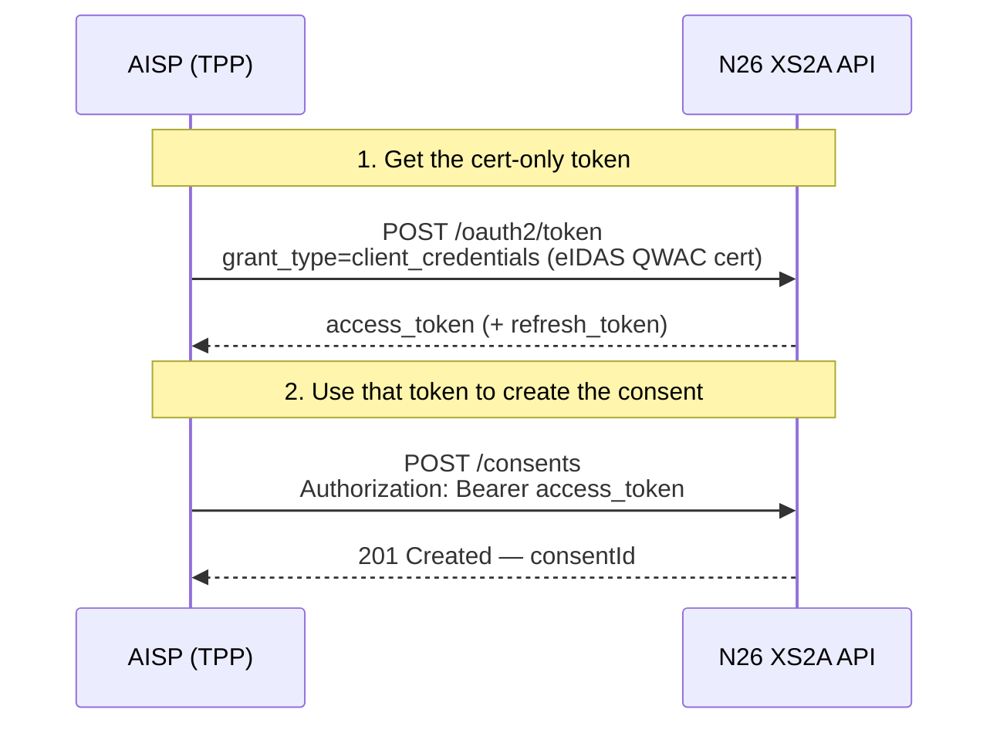
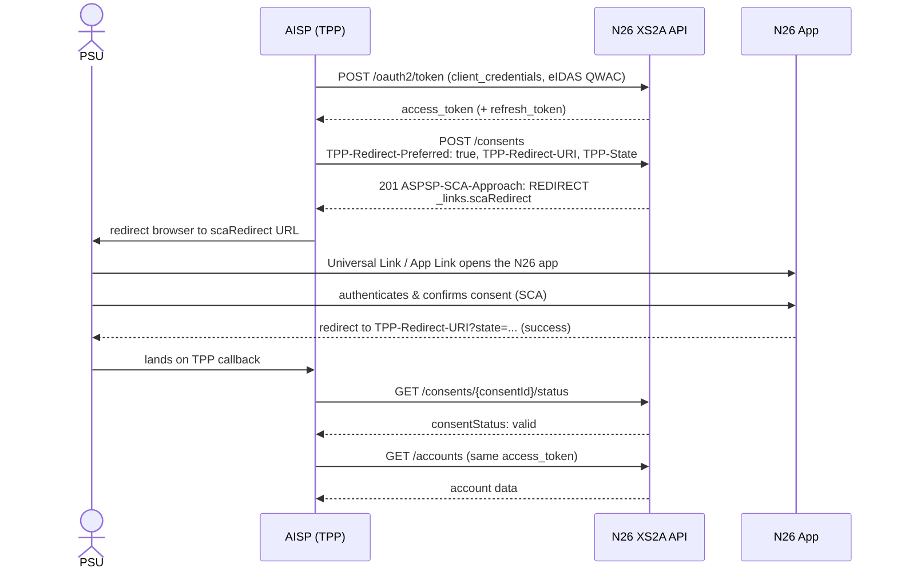

# N26 - PSD2 Dedicated Interface - AISP Access documentation

> :information_source: This document describes the **Redirect (App-to-App)** SCA approach for the N26
> PSD2 Dedicated Interface AISP flow. The TPP obtains a single cert-only access token, creates the
> AIS account-information consent with the `TPP-Redirect-Preferred: true` header, and redirects the PSU to
> the N26 app to authenticate. The PSU confirms directly in the N26 mobile app (App-to-App via a
> Universal Link / App Link) — or, when the app is not installed, on an N26 web page — and is then
> redirected back to the TPP.

1. [General information](./dedicated-aisp.md#general-information)
2. [Access & Identification of TPP](./dedicated-aisp.md#access--identification-of-tpp)
3. [Support for this implementation on the Berlin Group API](./dedicated-aisp.md#support-for-this-implementation-on-the-berlin-group-api)
4. [OAuth as a Pre-step](./dedicated-aisp.md#oauth-as-a-pre-step)
5. [Validity of access & refresh tokens](./dedicated-aisp.md#validity-of-access--refresh-tokens)
6. [Authentication endpoints](./dedicated-aisp.md#authentication-endpoints)
7. [Consent endpoints](./dedicated-aisp.md#consent-endpoints)
8. [AIS endpoints](./dedicated-aisp.md#ais-endpoints)
9. [Redirect SCA flow](./dedicated-aisp.md#redirect-sca-flow)
10. [Error scenarios](./dedicated-aisp.md#error-scenarios)

## General information

Berlin Group Conformity : [Implementation Guidelines version 1.3.6](https://www.berlin-group.org/nextgenpsd2-downloads)

Authorisation protocol: [oAuth 2.0](https://oauth.net/2/)

Security layer: A valid QWAC Certificate for PSD2 is required to access the Berlin Group API. The official list of
QTSP is available on the [European Comission eIDAS Trusted List](https://webgate.ec.europa.eu/tl-browser/#/). For the N26 PSD2 Dedicated Interface API, the QWAC
Certificate must be issued from a production certificate authority.

> :information_source: Certificates can be renewed by making an API call **using the new certificate**, which will then be onboarded automatically.

## Access & Identification of TPP

### Base URL

```https://xs2a.tech26.de```

### Sandbox URL

```https://xs2a.tech26.de/sandbox```

### On-boarding of new TPPs

1. A TPP shall connect to the N26 PSD2 dedicated API by using an eIDAS valid certificate (QWAC) issued
2. N26 shall check the QWAC certificate in an automated way and allow the TPP to identify themselves with the subsequent API calls
3. As the result of the steps above, the TPP should be able to continue using the API without manual involvement from the N26 side

## Support for this implementation on the Berlin Group API


| **Service**                                                                    | **Support**                      |
|--------------------------------------------------------------------------------|----------------------------------|
| Supported SCA Approaches                                                       | Redirect / App-to-App (OAuth2 client_credentials pre-step) |
| Maximum “frequency per day” supported by consents                              | 4                                |
| Consent scope: Global consent (allPsd2= allAccounts, allAccountsWithOwnerName) | Not Supported                    |
| Consent scope: availableAccounts= allAccounts                                  | Not Supported                    |
| Consent scope: availableAccountsWithBalances= allAccounts                      | Not Supported                    |
| Consent scope: Bank-offered consent                                            | Supported (the only supported model) |
| Consent scope: Detailed consent                                                | Not Supported                    |
| Consents with/without Recurring indicator                                      | Supported                        |
| SCA Validity                                                                   | 180 days                         |
| Redirect SCA completion timeout                                                | 10 minutes                       |
| Support of Signing Baskets                                                     | Not Supported                    |
| Support of Card accounts                                                       | Not Supported                    |
| Support of Multicurrency accounts                                              | Not Supported                    |
| Support of Account Owner extension                                             | Supported                        |
| Parameter withBalance=true                                                     | Not supported                    |
| Balance types supported                                                        | Expected                         |
| Transaction list retrieval through pagination                                  | Supported                        |
| Transaction list retrieval through deltaList                                   | Not supported                    |
| Transaction list format                                                        | application/json                 |
| Standing orders through bookingStatus=INFORMATION                              | Supported                        |
| App to app redirection                                                         | Supported                        |

## OAuth as a Pre-step

OAuth2 is supported by this API through a cert-only **`client_credentials`** grant. The TPP obtains a
single access token by calling `POST /oauth2/token` over an mTLS connection presenting its eIDAS QWAC
certificate — there is **no** browser-based PSU login, **no** authorization code, and **no** token
exchange step. N26 derives the TPP's `client_id` from the certificate.

The token response also returns a `refresh_token`, which the TPP uses to renew the access token.

The PSU is authenticated later, directly inside the N26 app, during the Redirect SCA step (see
[Redirect SCA flow](#redirect-sca-flow)).

> :information_source: Each access token is bound to **exactly one resource** — a single consent. The
> same token cannot be reused to initiate a second consent or payment.



## Validity of access & refresh tokens


|                | **Access Token**                                                                                                                                                                                                                                                                                                                                                | **Refresh Token**                                                                                                                                                                                                                                                                                                                                               |
| ---------------- | ----------------------------------------------------------------------------------------------------------------------------------------------------------------------------------------------------------------------------------------------------------------------------------------------------------------------------------------------------------------- | ----------------------------------------------------------------------------------------------------------------------------------------------------------------------------------------------------------------------------------------------------------------------------------------------------------------------------------------------------------------- |
| **Purpose**    | Access for API calls in **one session**                                                                                                                                                                                                                                                                                                                          | Generate new access tokens                                                                                                                                                                                                                                                                                                                                      |
| **How to get** | Call `POST /oauth2/token` with `grant_type=client_credentials` over mTLS with your eIDAS QWAC certificate. No PSU login or authorization code is required. | Existing refresh token |
| **Validity**   | 15 min                                                                                                                                                                                                                                                                                                                                                          | **One time usable** , but chain of refresh tokens is **valid for 200 days**                                                                                                                                                                                                                                                                                       |
| **Storage**    | NEVER                                                                                                                                                                                                                                                                                                                                                           | Yes, for 199 days (expiry needs to be stored on TPP)                                                                                                                                                                                                                                                                                                             |

> :information_source: **Refreshing refresh tokens**     
> The first refresh token has validity of 200 days, but is  **one-time usable**.
> With this refresh token, a new set of an access token and a refresh token can be requested.
> This new refresh token will maintain the initial 200 days validity.
> So, in summary, the chain of refresh tokens has a validity of 200 days.

> :information_source: **Refresh token getting close to expiry**   
> On day 199 the TPP should discard the refresh token and ask users for re-authentication.
> As highlighted above, the TPP should never store users' passwords.

> :warning: Access tokens are supposed to be used only for  **1 session (sequence of calls)** .    
> If users request a manual refresh, a new access token has to be requested **EVEN** if the original access token is still valid.
> For this reason the TPP should **NEVER** store the access token.

> :warning: The TPP should not use those access and refresh tokens on base URLs other than `xs2a.tech26.de`.

## Authentication endpoints

These endpoints are used to retrieve an access or refresh token for use with the /consents and /accounts endpoints.

Note: any values shown between curly braces should be taken as variables, while the ones not surrounded are to be read as literals.

### Obtain an access token

The TPP obtains a cert-only `client_credentials` access token bound to its eIDAS QWAC certificate. This single token is used to create the consent and call the AIS endpoints after SCA — no PSU login and no authorization code exchange take place.

#### Sample Request

```
POST    /oauth2/token?role=DEDICATED_AISP HTTP/1.1
Content-Type: application/x-www-form-urlencoded
(mTLS connection presenting the eIDAS QWAC certificate)

grant_type=client_credentials
```

Supported query parameters:

| **Name of query parameter** | **Description**                                                                     |
| --------------------------- | ----------------------------------------------------------------------------------- |
| role                        | Accepted value: "`DEDICATED_AISP`" to generate an AISP-only token. Mandatory field. |

Supported form parameters:

| **Name of parameter** | **Description**                                             |
| --------------------- | ---------------------------------------------------------- |
| grant_type            | Accepted value: "client_credentials". Mandatory parameter. |

#### Response

##### Successful

```
HTTP/1.1 200 OK
{
    "access_token": "{{access_token}}",
    "token_type": "bearer",
    "refresh_token": "{{refresh_token}}",
    "expires_in": {{expires_in_seconds}}
}
```

##### Unsuccessful

```
HTTP/1.1 400 Bad Request
{
    "error": "invalid_request"
}
```

### Refresh Token

When an access_token has expired, a TPP can request a new one by making use of the refresh token request, which will invalidate the token used for this request and generate a new pair of access_token and refresh_token.

#### Request

```
POST    /oauth2/token?role=DEDICATED_AISP HTTP/1.1
Content-Type: application/x-www-form-urlencoded

grant_type=refresh_token&
refresh_token={{refresh_token}}
```

Supported query parameters:


| **Name of query parameter** | **Description**                                                                      |
| ----------------------------- | -------------------------------------------------------------------------------------- |
| role                        | Accepted value: “`DEDICATED_AISP`” to generate a AISP-only token. Mandatory field. |

Supported form parameters:


| **Name of parameter** | **Description**                                                               |
| ----------------------- | ------------------------------------------------------------------------------- |
| grant_type            | Accepted value: “refresh_token”. Mandatory parameter.                       |
| refresh_token         | The refresh token from the last POST /oauth2/token call. Mandatory parameter. |

#### Response

##### Successful

```
HTTP/1.1 200 OK
{
    "access_token": "{{access_token}}",
    "token_type": "bearer",
    "refresh_token": "{{refresh_token}}",
    "expires_in": {{expires_in_seconds}}
}
```

## Consent endpoints

Please use your QWAC certificate when calling for any Consent request on `xs2a.tech26.de`, along with a valid access 
token retrieved as per the oauth session.

### Create consent

To request the Redirect (App-to-App) SCA approach, send the following headers with the create-consent request:

| **Header**             | **Description**                                                                                                    |
| ---------------------- | ----------------------------------------------------------------------------------------------------------------- |
| TPP-Redirect-Preferred | Must be set to `true` to select the Redirect SCA approach. Mandatory for this flow.                               |
| TPP-Redirect-URI       | The URI N26 redirects the PSU back to after SCA. Mandatory when `TPP-Redirect-Preferred=true`.                    |
| TPP-State              | Opaque value echoed back on the redirect callback so the TPP can correlate the response. Optional but recommended. |

> :warning: If `TPP-Redirect-Preferred` is `true` but `TPP-Redirect-URI` is missing or malformed, the
> request is rejected with `400 Bad Request` and a `FORMAT_ERROR` message.

#### Request

With the Redirect (App-to-App) SCA approach, N26 always creates the consent as a **Bank Offered Consent** — the TPP does **not** name any accounts. The `access` object must be sent with **empty** `accounts`, `balances` and `transactions` arrays; the PSU then selects which accounts to share directly in the N26 app during SCA. `recurringIndicator` is mandatory.

> :warning: Bank Offered Consent is the **only** supported consent-creation model for the Redirect approach. Any accounts/IBANs or `allPsd2` value sent in the `access` object is ignored — the granted scope is always the set of accounts the PSU selects in the app.

```
POST    /v1/berlin-group/v1/consents HTTP/1.1
Authorization: bearer {{access_token}}
Content-Type: application/json
TPP-Redirect-Preferred: true
TPP-Redirect-URI: https://tpp.com/redirect
TPP-State: 1fL1nn7m9a

{
  "access": {
    "accounts": [],
    "balances": [],
    "transactions": []
  },
  "recurringIndicator": true,
  "validUntil": "2026-12-01",
  "frequencyPerDay": "4"
}
```

#### Response

```
ASPSP-SCA-Approach: REDIRECT

{
    "consentStatus": "received",
    "consentId": "fb44eb9c-d12f-4aef-90bd-726c47f2e864",
    "_links": {
        "scaRedirect": {
            "href": "https://app.n26.com/wl/open-banking/aisp?consentId=fb44eb9c-d12f-4aef-90bd-726c47f2e864"
        },
        "status": {
            "href": "/v1/berlin-group/v1/consents/fb44eb9c-d12f-4aef-90bd-726c47f2e864/status"
        },
        "scaStatus": {
            "href": "/v1/berlin-group/v1/consents/fb44eb9c-d12f-4aef-90bd-726c47f2e864/authorisations/985f9d29-10ee-4ab0-90d6-6c2aeda65852"
        }
    }
}
```

### Get consent status

This endpoint is intended to be polled by the TPP to determine whether the users have confirmed the consent in the N26 app. Please note that users have up to 10 minutes to confirm consent, and thus the time taken for the status to change is dependent on the user.

#### Request

```
GET    /v1/berlin-group/v1/consents/{{consentId}}/status HTTP/1.1
Authorization: bearer {{access_token}}
X-Request-ID: {{Unique UUID}}
Content-Type: application/json
```

>ℹ️  This endpoint should not be polled more than **two times per second**. After a terminal status is reached (`REJECTED`; `VALID`; `EXPIRED`; `REVOKED_BY_PSU`; `TERMINATED_BY_TPP`), the polling should stop.


#### Response

```
{
    "consentStatus": "received"
}
```

### Get consent

#### Request

```
GET    /v1/berlin-group/v1/consents/{{consentId}} HTTP/1.1
Authorization: bearer {{access_token}}
X-Request-ID: {{Unique UUID}}
Content-Type: application/json
```

#### Response

Once the PSU has approved, the consent reflects exactly the accounts the PSU selected, listed by IBAN:

```
{
    "access": {
        "accounts": [
            { "iban": "DE05100110012802645265" },
            { "iban": "DE73100110012852278456" }
        ],
        "balances": [
            { "iban": "DE05100110012802645265" },
            { "iban": "DE73100110012852278456" }
        ],
        "transactions": [
            { "iban": "DE05100110012802645265" },
            { "iban": "DE73100110012852278456" }
        ]
    },
    "recurringIndicator": true,
    "validUntil": "2026-11-01",
    "frequencyPerDay": 4,
    "lastActionDate": "2026-08-03",
    "consentStatus": "valid",
    "_links": {
        "account": {
            "href": "/v1/berlin-group/v1/accounts"
        }
    }
}
```

> :information_source: If the PSU also grants access to an N26 **Space**, it is **not** listed here — a Space has no IBAN, so it cannot appear in the `access` lists. The shared Space is still returned by [Read Account List](#read-account-list) (`GET /v1/berlin-group/v1/accounts`), identified by its `resourceId`.

### Delete consent

#### Request

```
DELETE    /v1/berlin-group/v1/consents/{{consentId}} HTTP/1.1
Authorization: bearer {{access_token}}
X-Request-ID: {{Unique UUID}}
Content-Type: application/json
```

#### Response

```
HTTP/1.1 204 No Content
```

### Get authorisations

#### Request

```
GET    /v1/berlin-group/v1/consents/{{consentId}}/authorisations HTTP/1.1
Authorization: bearer {{access_token}}
X-Request-ID: {{Unique UUID}}
Content-Type: application/json
```

#### Response

```
{
    "authorisationIds": [
        "e93bf74e-9444-4a5e-8524-648d80848126"
    ]
}
```

### Get authorisation

#### Request

```
GET    /v1/berlin-group/v1/consents/{{consentId}}/authorisations/{{authorisationId}} HTTP/1.1
Authorization: bearer {{access_token}}
X-Request-ID: {{Unique UUID}}
Content-Type: application/json
```

>ℹ️  This endpoint should not be polled more than **one time per second**. After a terminal status is reached (`FINALISED`; `FAILED`), the polling should stop.

#### Response

```
{
    "scaStatus": "finalised"
}
```

## AIS endpoints


### Read Account List
Please use your QWAC certificate when calling for any Accounts request on `xs2a.tech26.de`, along with a valid 
access token retrieved during [Oauth](./dedicated-aisp.md#validity-of-access--refresh-tokens) session.

#### Request

```
GET    /v1/berlin-group/v1/accounts HTTP/1.1
Authorization: bearer {{access_token}}
Consent-ID: {{consent_id}}
X-Request-ID: {{Unique UUID}}
PSU-IP-Address: {{Users'IP if they are present}}
Content-Type: application/json
```

* withBalance parameter is currently not supported.

#### Response

With the Redirect (App-to-App) approach the consent is always a **Bank Offered Consent**, so the `ownerName` field is **not** returned. Accounts without IBANs may be returned, corresponding to the N26 Spaces the PSU chose to share.

```
X-Request-ID: {{Unique UUID}}
{
  "accounts": [
    {
      "resourceId": "6d3fc103-23c1-429c-9809-fc7672ea21c1",
      "iban": "DE05100110012802645265",
      "currency": "EUR",
      "product": "Joint Account",
      "name": "Aiyana & Wayne",
      "bic": "NTSBDEB1XXX",
      "cashAccountType": "CACC",
      "status": "enabled",
      "usage": "PRIV",
      "_links": {
        "balances": {
          "href": "/v1/berlin-group/v1/accounts/6d3fc103-23c1-429c-9809-fc7672ea21c1/balances"
        },
        "transactions": {
          "href": "/v1/berlin-group/v1/accounts/6d3fc103-23c1-429c-9809-fc7672ea21c1/transactions"
        }
      }
    },
    {
      "resourceId": "a128ed07-5437-4f4f-9377-a7c0466ce9ef",
      "currency": "EUR",
      "product": "Individual Space",
      "name": "trip space",
      "cashAccountType": "TRAN",
      "status": "enabled",
      "usage": "PRIV",
      "_links": {
        "balances": {
          "href": "/v1/berlin-group/v1/accounts/a128ed07-5437-4f4f-9377-a7c0466ce9ef/balances"
        },
        "transactions": {
          "href": "/v1/berlin-group/v1/accounts/a128ed07-5437-4f4f-9377-a7c0466ce9ef/transactions"
        }
      }
    },
    {
      "resourceId": "62a56502-4547-4447-9383-9dbf97aedb82",
      "currency": "EUR",
      "product": "Shared Space",
      "name": "apartment space",
      "cashAccountType": "TRAN",
      "status": "enabled",
      "usage": "PRIV",
      "_links": {
        "balances": {
          "href": "/v1/berlin-group/v1/accounts/62a56502-4547-4447-9383-9dbf97aedb82/balances"
        },
        "transactions": {
          "href": "/v1/berlin-group/v1/accounts/62a56502-4547-4447-9383-9dbf97aedb82/transactions"
        }
      }
    },
    {
      "resourceId": "543de370-0654-4cd6-8213-051bc0cf435a",
      "iban": "DE73100110012852278456",
      "currency": "EUR",
      "product": "Individual Current Account",
      "name": "Main Account",
      "bic": "NTSBDEB1XXX",
      "cashAccountType": "CACC",
      "status": "enabled",
      "usage": "PRIV",
      "_links": {
        "balances": {
          "href": "/v1/berlin-group/v1/accounts/543de370-0654-4cd6-8213-051bc0cf435a/balances"
        },
        "transactions": {
          "href": "/v1/berlin-group/v1/accounts/543de370-0654-4cd6-8213-051bc0cf435a/transactions"
        }
      }
    },
    {
      "resourceId": "142a69b6-d9a3-43db-a641-b082159bee2b",
      "currency": "EUR",
      "product": "Individual Space",
      "name": "house space",
      "cashAccountType": "TRAN",
      "status": "enabled",
      "usage": "PRIV",
      "_links": {
        "balances": {
          "href": "/v1/berlin-group/v1/accounts/142a69b6-d9a3-43db-a641-b082159bee2b/balances"
        },
        "transactions": {
          "href": "/v1/berlin-group/v1/accounts/142a69b6-d9a3-43db-a641-b082159bee2b/transactions"
        }
      }
    },
    {
      "resourceId": "80ff6dfb-c1c5-44d0-bc81-f6de437ebd06",
      "iban": "DE16100110012703791106",
      "currency": "EUR",
      "product": "Individual Space",
      "name": "car space",
      "bic": "NTSBDEB1XXX",
      "cashAccountType": "CACC",
      "status": "enabled",
      "usage": "PRIV",
      "_links": {
        "balances": {
          "href": "/v1/berlin-group/v1/accounts/80ff6dfb-c1c5-44d0-bc81-f6de437ebd06/balances"
        },
        "transactions": {
          "href": "/v1/berlin-group/v1/accounts/80ff6dfb-c1c5-44d0-bc81-f6de437ebd06/transactions"
        }
      }
    },
    {
      "resourceId": "5a15a96b-0765-4d40-bbc3-05e5b5688297",
      "iban": "DE50100110012583312129",
      "currency": "EUR",
      "product": "Individual Instant Saving",
      "name": "Instant Savings",
      "bic": "NTSBDEB1XXX",
      "cashAccountType": "SVGS",
      "status": "enabled",
      "usage": "PRIV",
      "_links": {
        "balances": {
          "href": "/v1/berlin-group/v1/accounts/5a15a96b-0765-4d40-bbc3-05e5b5688297/balances"
        },
        "transactions": {
          "href": "/v1/berlin-group/v1/accounts/5a15a96b-0765-4d40-bbc3-05e5b5688297/transactions"
        }
      }
    }
  ]
}
```

### Read Account Details

#### Request

```
GET    /v1/berlin-group/v1/accounts/{{resourceId}} HTTP/1.1
Authorization: bearer {{access_token}}
Consent-ID: {{consent_id}}
X-Request-ID: {{Unique UUID}}
PSU-IP-Address: {{Users'IP if they are present}}
Content-Type: application/json
```

* withBalance parameter is currently not supported.

#### Response

With the Redirect (App-to-App) approach the consent is always a **Bank Offered Consent**, so the `ownerName` field is **not** returned. Accounts without IBANs may be returned, corresponding to the N26 Spaces the PSU chose to share.

```
X-Request-ID: {{Unique UUID}}
{
    "account": {
        "resourceId": "543de370-0654-4cd6-8213-051bc0cf435a",
        "iban": "DE73100110012852278456",
        "currency": "EUR",
        "product": "Individual Current Account",
        "name": "Main Account",
        "bic": "NTSBDEB1XXX",
        "cashAccountType": "CACC",
        "status": "enabled",
        "usage": "PRIV",
        "_links": {
            "balances": {
                "href": "/v1/berlin-group/v1/accounts/543de370-0654-4cd6-8213-051bc0cf435a/balances"
            },
            "transactions": {
                "href": "/v1/berlin-group/v1/accounts/543de370-0654-4cd6-8213-051bc0cf435a/transactions"
            }
        }
    }
}
```

### Read Balance

#### Request

```
GET    /v1/berlin-group/v1/accounts/{{resourceId}}/balances HTTP/1.1
Authorization: bearer {{access_token}}
Consent-ID: {{consent_id}}
X-Request-ID: {{Unique UUID}}
PSU-IP-Address: {{Users'IP if they are present}}
Content-Type: application/json
```

#### Response

```
X-Request-ID: {{Unique UUID}}

{
    "balances": [
        {
            "balanceType": "expected",
            "balanceAmount": {
                "amount": "55.55",
                "currency": "EUR"
            },
            "lastChangeDateTime": "2020-07-30T15:59:20.162Z"
        }
    ],
    "account": {
        "iban": "DE73100110012629586632"
    }
}
```

### Read Transaction List

Generally, GET /transactions requests are limited to a period of 90 days from the time the request is made. The only exception to this limitation applies during the first 15 minutes of an AIS consent lifecycle. In this time period, any GET /transactions request made will not be limited by time range. After this time period, the above limitation will apply, and any requests trying to retrieve transactions older than 90 days will be rejected.

The list of transactions is returned in reverse chronological order, therefore newer transactions are listed first.

#### Request

```
GET    /v1/berlin-group/v1/accounts/{{resourceId}}/transactions HTTP/1.1
Authorization: bearer {{access_token}}
Consent-ID: {{consent_id}}
X-Request-ID: {{Unique UUID}}
PSU-IP-Address: {{Users'IP if they are present}}
Content-Type: application/json
```

* Query parameter “bookingStatus” is supported with values “booked” and “information”
* Query parameters “dateFrom” and “dateTo” are supported when “bookingStatus” is not “information“
* Query parameter “withBalance”  is currently not supported.
* Query parameter “deltaList” is currently not supported.
* Pagination through “_links” is currently supported, and is based on time-range.

#### Response

```
X-Request-ID: {{Unique UUID}}

{
    "account": {
        "iban": "DE73100110012629586632"
    },
    "transactions": {
        "booked": [
            {
                "transactionId": "7f9da399-8c53-4c68-b43c-c7e22a0c70d2",
                "creditorName": "User SEPA",
                "creditorAccount": {
                    "iban": "DE43100110012620287103"
                },
                "transactionAmount": {
                    "amount": "-20.0",
                    "currency": "EUR"
                },
                "bookingDate": "2020-07-22",
                "valueDate": "2020-07-22",
                "remittanceInformationUnstructuredArray":["Payback for lunch"],
                "remittanceInformationUnstructured":"Payback for lunch",
                "bankTransactionCode": "PMNT-ICDT-ESCT"
            },
            {
                "transactionId":"df0fed01-f949-4909-88c3-f1c01d2972ca",
                "debtorName":"User SEPA 2",
                "debtorAccount":{"iban":"DE65100110011234567890"},
                "transactionAmount": {
                    "amount":"22.0",
                    "currency":"EUR"
                },
                "bookingDate":"2020-07-20",
                "valueDate":"2020-07-20",
                "remittanceInformationUnstructuredArray":["Payback for drinks"],
                "remittanceInformationUnstructured":"Payback for drinks",
                "bankTransactionCode":"PMNT-RCDT-ESCT"
            },
            {
              "transactionId": "8943aefb-ec2b-46fa-8a38-dc264af13eb5",
              "additionalInformation":"67d507fd-c9e7-4d43-a799-103d37da65db",        
              "creditorName": "Merchant A",
              "transactionAmount": {
                "amount": "-9.50",
                "currency": "EUR"
              },
              "bookingDate": "2022-07-15",
              "valueDate": "2022-07-15",
              "remittanceInformationUnstructuredArray":["-"],
              "remittanceInformationUnstructured":"-",
              "bankTransactionCode": "PMNT-CCRD-POSD"
            },
            {
                "transactionId": "7f9da399-8c53-4c68-b43c-c7e22a0c70d2",
                "creditorName": "Merchant B",
                "creditorAccount": {
                    "iban": "DE43100110012620287103"
                },
                "transactionAmount": {
                    "amount": "-7.99",
                    "currency": "EUR"
                },
                "bookingDate": "2022-07-05",
                "valueDate": "2022-07-05",
                "remittanceInformationUnstructuredArray": ["Monthly fee"],
                "remittanceInformationUnstructured": "Monthly fee",
                "bankTransactionCode": "PMNT-IDDT-ESDD",
                "mandateId": "4ABK2252MNG98",
                "creditorId": "AB98ZZZ0000000000048"
            }
        ],
        "_links": {
            "account": {
                "href": "/v1/berlin-group/v1/accounts/9ce689d3-d7ce-4159-9405-d6756d645564"
            }
        }
    }
}
```
* additionalInformation is an ID that links different transactions related to the same purchase
* mandateId and creditorId are supported for SEPA direct debit transactions only
* Both remittanceInformationUnstructuredArray and remittanceInformationUnstructured are provided, where applicable

#### Response with pagination

<details>
<summary>Show full transaction response (click to expand)</summary>

```
X-Request-ID: {{Unique UUID}}

{
    "account": {
        "iban": "DE73100110012629586632"
    },
    "transactions": {
        "booked": [
            {
                "transactionId": "7f9da399-8c53-4c68-b43c-c7e22a0c70d2",
                "creditorName": "User SEPA",
                "creditorAccount": {
                    "iban": "DE43100110012620287103"
                },
                "transactionAmount": {
                    "amount": "-20.0",
                    "currency": "EUR"
                },
                "bookingDate": "2020-07-22",
                "valueDate": "2020-07-22",
                "remittanceInformationUnstructuredArray":["Payback for lunch"],
                "remittanceInformationUnstructured":"Payback for lunch",
                "bankTransactionCode": "PMNT-ICDT-ESCT"
            },
            {
                "transactionId":"df0fed01-f949-4909-88c3-f1c01d2972ca",
                "debtorName":"User SEPA 2",
                "debtorAccount":{"iban":"DE65100110011234567890"},
                "transactionAmount": {
                    "amount":"22.0",
                    "currency":"EUR"
                },
                "bookingDate":"2020-07-20",
                "valueDate":"2020-07-20",
                "remittanceInformationUnstructuredArray":["Payback for drinks"],
                "remittanceInformationUnstructured":"Payback for drinks",
                "bankTransactionCode":"PMNT-RCDT-ESCT"
            },
            {
              "transactionId": "8943aefb-ec2b-46fa-8a38-dc264af13eb5",
              "additionalInformation":"67d507fd-c9e7-4d43-a799-103d37da65db",        
              "creditorName": "Merchant A",
              "transactionAmount": {
                "amount": "-9.50",
                "currency": "EUR"
              },
              "bookingDate": "2022-07-15",
              "valueDate": "2022-07-15",
              "remittanceInformationUnstructuredArray":["-"],
              "remittanceInformationUnstructured":"-",
              "bankTransactionCode": "PMNT-CCRD-POSD"
            },
            {
                "transactionId": "7f9da399-8c53-4c68-b43c-c7e22a0c70d2",
                "creditorName": "Merchant B",
                "creditorAccount": {
                    "iban": "DE43100110012620287103"
                },
                "transactionAmount": {
                    "amount": "-7.99",
                    "currency": "EUR"
                },
                "bookingDate": "2022-07-05",
                "valueDate": "2022-07-05",
                "remittanceInformationUnstructuredArray": ["Monthly fee"],
                "remittanceInformationUnstructured": "Monthly fee",
                "bankTransactionCode": "PMNT-IDDT-ESDD",
                "mandateId": "4ABK2252MNG98",
                "creditorId": "AB98ZZZ0000000000048"
            }
        ],
        "_links": {
            "account": {
                "href": "/v1/berlin-group/v1/accounts/9ce689d3-d7ce-4159-9405-d6756d645564"
            },
            "next": {
                "href": "/v1/berlin-group/v1/accounts/9ce689d3-d7ce-4159-9405-d6756d645564/transactions?dateFrom=2022-04-04&dateTo2022-07-04"
            }
        }
    }
}
```
</details>

### Read Transaction Details

#### Request

```
GET    /v1/berlin-group/v1/accounts/{{resourceId}}/transactions/{{transactionId}} HTTP/1.1
Authorization: bearer {{access_token}}
Consent-ID: {{consent_id}}
X-Request-ID: {{Unique UUID}}
PSU-IP-Address: {{Users'IP if they are present}}
Content-Type: application/json
```

* Query parameter “withBalance”  is currently not supported.
* Only transactions are supported, not standing orders.

#### Response

```
X-Request-ID: {{Unique UUID}}

{
        "transactionId": "4b856f12-a75c-449f-8e71-69bd72947445",
        "additionalInformation":"5bccb1ed-67a4-48a1-8a88-3feec03a6952"
        "creditorName": "NOAPV21EQZYWG0NC0KNMMW",
        "transactionAmount": {
            "amount": "-1.0",
            "currency": "EUR"
        },
        "bookingDate": "2020-07-13",
        "valueDate": "2020-07-13",
        "bankTransactionCode": "PMNT-MCRD-UPCT"
    }
}
```
* mandateId and creditorId are supported for SEPA direct debit transactions only
* Both remittanceInformationUnstructuredArray and remittanceInformationUnstructured are provided, where applicable

### Read Standing order List

#### Request

```
GET    /v1/berlin-group/v1/accounts/{{resourceId}}/transactions?bookingStatus=information HTTP/1.1
Authorization: bearer {{access_token}}
Consent-ID: {{consent_id}}
X-Request-ID: {{Unique UUID}}
PSU-IP-Address: {{Users'IP if they are present}}
Content-Type: application/json
```

* Query parameters “dateFrom” and “dateTo” are not supported for standing orders
* Pagination through “_links” is currently not supported.

#### Response

```
X-Request-ID: {{Unique UUID}}

{
    "account": {
        "iban": "DE73100110012629586632"
    },
    "transactions": {
        "information": [
            {
                "creditorName": "Recipient",
                "creditorAccount": {
                    "iban": "DE12500105170648489890"
                },
                "transactionAmount": {
                    "amount": "1.00",
                    "currency": "EUR"
                },
                "remittanceInformationUnstructured": "Standing order",
                "additionalInformationStructured": {
                    "standingOrderDetails": {
                        "startDate": "2021-08-13",
                        "frequency": "MNTH"
                    }
                }
            }
        ],
        "_links": {
            "account": {
                "href": "/v1/berlin-group/v1/accounts/9ce689d3-d7ce-4159-9405-d6756d645564"
            }
        }
    }
}
```

## Redirect SCA flow

With the Redirect (App-to-App) SCA approach the PSU authenticates directly in the N26 app instead of
confirming an out-of-band push notification. The end-to-end sequence is:



1. The TPP obtains a cert-only `client_credentials` access token (see
   [Obtain an access token](#obtain-an-access-token)).
2. The TPP creates the consent with the `TPP-Redirect-Preferred: true`, `TPP-Redirect-URI` and
   (optionally) `TPP-State` headers. For bank-offered consent, the PSU selects the accounts to share
   in the N26 app.
3. N26 responds with `ASPSP-SCA-Approach: REDIRECT` and a `scaRedirect` entry in the `_links` object.
4. The TPP redirects the PSU's browser to the `scaRedirect` URL.
5. The `scaRedirect` URL is a Universal Link (iOS) / App Link (Android). If the N26 app is installed it
   opens directly (App-to-App); otherwise the PSU continues on an N26 web page.
6. The PSU authenticates and confirms the consent inside the N26 app.
7. N26 redirects the PSU back to the TPP's `TPP-Redirect-URI`:
   - On success: `TPP-Redirect-URI?state=<TPP-State>` (the `state` parameter is omitted if no
     `TPP-State` was provided).
   - On failure: `TPP-Redirect-URI?error=access_denied&state=<TPP-State>`.
8. The TPP can then poll the consent status / `scaStatus` and, once the consent is `valid`, call the
   [AIS endpoints](#ais-endpoints) with the same access token.

> :warning: **The PSU must complete the Redirect SCA within 10 minutes.** If the consent is not
> authorised within this window, N26 moves it to a terminal `expired` `consentStatus` so it is never
> left pending. The TPP must then create a new consent to start a fresh SCA.

The `scaRedirect` base URL depends on the environment:

| **Environment** | **scaRedirect URL**                                                    |
| --------------- | ---------------------------------------------------------------------- |
| Production      | `https://app.n26.com/wl/open-banking/aisp?consentId={{consentId}}`      |
| Sandbox/Staging | `https://app.staging-n26.com/wl/open-banking/aisp?consentId={{consentId}}` |

## Error scenarios

When the SCA cannot be completed, N26 redirects the PSU back to the `TPP-Redirect-URI` with an `error`
query parameter instead of a success response. The following parameters may be present on the callback:

| **Query parameter** | **Description**                                                                                     |
| ------------------- | --------------------------------------------------------------------------------------------------- |
| error               | Present only on failure. `access_denied` (the PSU declined or did not complete SCA) or `server_error` (an unexpected error occurred on the N26 side). |
| state               | The value provided in the `TPP-State` header on consent creation, echoed back so the TPP can correlate the callback. Omitted if no `TPP-State` was sent. |

Example failure callback:

```
GET https://tpp.com/redirect?error=access_denied&state=1fL1nn7m9a
```

> :information_source: **SCA not completed within 10 minutes.** If the PSU never finishes the SCA,
> the consent is moved to `expired` and the redirect session is closed as a failure
> (`?error=access_denied`). Poll `GET /consents/{consentId}/status` to detect the terminal
> `expired` state.
