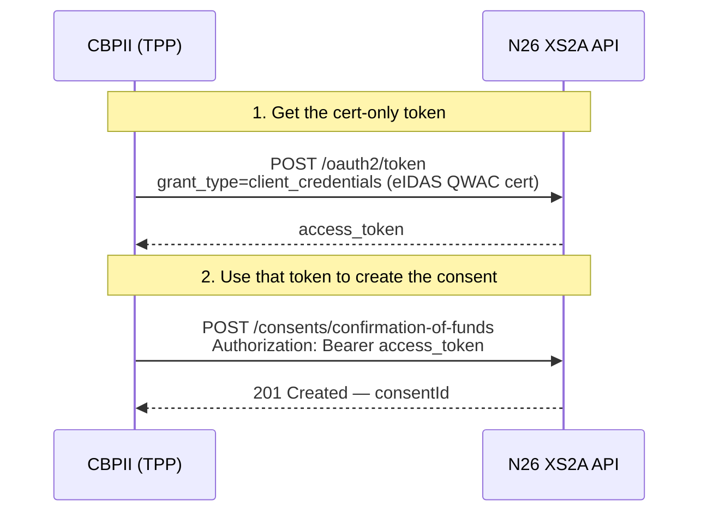
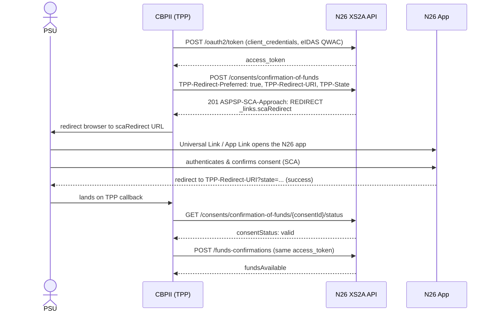

# N26 - PSD2 Dedicated Interface - CBPII Access documentation

> :information_source: This document describes the **Redirect (App-to-App)** SCA approach for the N26
> PSD2 Dedicated Interface CBPII flow. The TPP obtains a single cert-only access token, creates the
> funds-confirmation consent with the `TPP-Redirect-Preferred: true` header, and redirects the PSU to
> the N26 app to authenticate. The PSU confirms directly in the N26 mobile app (App-to-App via a
> Universal Link / App Link) — or, when the app is not installed, on an N26 web page — and is then
> redirected back to the TPP.

1. [General information](./dedicated-cbpii.md#general-information)
2. [Access & Identification of TPP](./dedicated-cbpii.md#access--identification-of-tpp)
3. [Support for this implementation on the Berlin Group API](./dedicated-cbpii.md#support-for-this-implementation-on-the-berlin-group-api)
4. [OAuth as a Pre-step](./dedicated-cbpii.md#oauth-as-a-pre-step)
5. [Authentication endpoints](./dedicated-cbpii.md#authentication-endpoints)
6. [CBPII Consent endpoints](./dedicated-cbpii.md#CBPII-consent-endpoints)
7. [CBPII endpoints](./dedicated-cbpii.md#CBPII-endpoints)
8. [Redirect SCA flow](./dedicated-cbpii.md#redirect-sca-flow)
9. [Error scenarios](./dedicated-cbpii.md#error-scenarios)

## General information

Berlin Group Conformity : [Implementation Guidelines version 1.3.6](https://www.berlin-group.org/nextgenpsd2-downloads "https://www.berlin-group.org/nextgenpsd2-downloads")

Authorisation protocol: [oAuth 2.0](https://oauth.net/2/ "https://oauth.net/2/")

Security layer: A valid QWAC Certificate for PSD2 is required to access the Berlin Group API. The official list of QTSP is available on the [European Comission eIDAS Trusted List](https://webgate.ec.europa.eu/tl-browser/##/ "https://webgate.ec.europa.eu/tl-browser/##/"). For the N26 PSD2 Dedicated Interface API, the QWAC Certificate must be issued from a production certificate authority.

> :information_source: Certificates can be renewed by making an API call **using the new certificate**, which will then 
> be onboarded automatically.  

## Access & Identification of TPP

### Base URL

`https://xs2a.tech26.de`
### Sandbox URL

`https://xs2a.tech26.de/sandbox`

### On-boarding of new TPPs

1. A TPP shall connect to the N26 PSD2 dedicated API by using an eIDAS valid certificate (QWAC) issued
2. N26 shall check the QWAC certificate in an automated way and allow the TPP to identify themselves  with the subsequent API calls
3. As the result of the steps above, the TPP should be able to continue using the API without manual involvement from the N26 side

## Support for this implementation on the Berlin Group API


| **Service**              | **Support**                      |
|--------------------------|----------------------------------|
| Supported SCA Approaches | Redirect / App-to-App (OAuth2 client_credentials pre-step) |
| SCA Validity             | 20 minutes                       |
| Redirect SCA completion timeout | 10 minutes                |
| Confirmations of funds   | Supported                        |
| App to app redirection   | Supported                        |

## OAuth as a Pre-step

OAuth2 is supported by this API through a cert-only **`client_credentials`** grant. The TPP obtains a
single access token by calling `POST /oauth2/token` over an mTLS connection presenting its eIDAS QWAC
certificate — there is **no** browser-based PSU login, **no** authorization code, and **no** token
exchange step. N26 derives the TPP's `client_id` from the certificate.

The PSU is authenticated later, directly inside the N26 app, during the Redirect SCA step (see
[Redirect SCA flow](#redirect-sca-flow)).

> :information_source: Each access token is bound to **exactly one resource** — a single
> funds-confirmation consent. The same token cannot be reused to initiate a second consent or payment.



### Validity of access token


|                | **Access Token**                                                                                                                                                                                                                                                                                                                          |
| ---------------- |-------------------------------------------------------------------------------------------------------------------------------------------------------------------------------------------------------------------------------------------------------------------------------------------------------------------------------------------|
| **Purpose**    | Access for API calls in **one session**                                                                                                                                                                                                                                                                                                   |
| **How to get** | Call `POST /oauth2/token` with `grant_type=client_credentials` over mTLS with your eIDAS QWAC certificate. No PSU login or authorization code is required.                                                                                                                                                                                                                                                                                                                                                                    |
| **Validity**   | 15 min                                                                                                                                                                                                                                                                                                                                    |
| **Storage**    | NEVER                                                                                                                                                                                                                                                                                                                                     |

> :information_source: **CBPII flow does not provide refresh tokens for security purposes**

> :warning: The TPP should not use those access tokens on base URLs other than `xs2a.tech26.de`.
Access tokens issued for CBPII cannot be used for AISP flows nor PISP flows.

## Authentication endpoints

These endpoints are used to retrieve an access token for use with the /consents/confirmation-of-funds and /funds-confirmations endpoints.

Note: any values shown between curly braces should be taken as variables, while the ones not surrounded are to be read as literals.

### Obtain an access token

The TPP obtains a cert-only `client_credentials` access token bound to its eIDAS QWAC certificate. This single token is used both to create the funds-confirmation consent and to call the funds-confirmation endpoint after SCA — no PSU login and no authorization code exchange take place.

#### Sample Request

```
POST    /oauth2/token?role=DEDICATED_CBPII HTTP/1.1
Content-Type: application/x-www-form-urlencoded
(mTLS connection presenting the eIDAS QWAC certificate)

grant_type=client_credentials
```

Supported query parameters:

| **Name of query parameter** | **Description**                                                                      |
| --------------------------- | ----------------------------------------------------------------------------------- |
| role                        | Accepted value: "`DEDICATED_CBPII`" to generate a CBPII-only token. Mandatory field. |

Supported form parameters:

| **Name of parameter** | **Description**                                             |
| --------------------- | ---------------------------------------------------------- |
| grant_type            | Accepted value: "client_credentials". Mandatory parameter. |

#### Response

##### Successful

Note that no refresh tokens are provided for security purposes.

```
HTTP/1.1 200 OK
{
    "access_token": "{{access_token}}",
    "token_type": "bearer",
    "expires_in": {{expires_in_seconds}}
}
```

##### Unsuccessful

```
HTTP/1.1 400 Bad Request
{
    "error": "invalid_request"
}
```

## CBPII Consent endpoints

Please use your QWAC certificate when calling for any Consent request on `xs2a.tech26.de`, along with a valid access 
token retrieved as per the oauth session.

> :warning: We use a different endpoint than the one that we use for AIS consent. For AIS we are using
`/v1/berlin-group/v1/consents` and for CBPII we use `/v1/berlin-group/v1/consents/confirmation-of-funds`.

### Create consent

To request the Redirect (App-to-App) SCA approach, send the following headers with the create-consent request:

| **Header**             | **Description**                                                                                                    |
| ---------------------- | ----------------------------------------------------------------------------------------------------------------- |
| TPP-Redirect-Preferred | Must be set to `true` to select the Redirect SCA approach. Mandatory for this flow.                               |
| TPP-Redirect-URI       | The URI N26 redirects the PSU back to after SCA. Mandatory when `TPP-Redirect-Preferred=true`.                    |
| TPP-State              | Opaque value echoed back on the redirect callback so the TPP can correlate the response. Optional but recommended. |

> :warning: If `TPP-Redirect-Preferred` is `true` but `TPP-Redirect-URI` is missing or malformed, the
> request is rejected with `400 Bad Request` and a `FORMAT_ERROR` message.

#### Request (consent by IBAN)

```
POST    /v1/berlin-group/v1/consents/confirmation-of-funds HTTP/1.1
Authorization: bearer {{access_token}}
Content-Type: application/json
TPP-Redirect-Preferred: true
TPP-Redirect-URI: https://tpp.com/redirect
TPP-State: 1fL1nn7m9a

{
  "account": {
      "iban" : "DE73100110012629586632"
      }
}
```

#### Response

```
ASPSP-SCA-Approach: REDIRECT

{
    "consentStatus": "received",
    "consentId": "55ecfaab-786a-4363-94af-2401f0a4bc65",
    "_links": {
        "scaRedirect": {
            "href": "https://app.n26.com/wl/open-banking/cbpii?consentId=55ecfaab-786a-4363-94af-2401f0a4bc65"
        },
        "status": {
            "href": "/v1/berlin-group/v1/consents/confirmation-of-funds/55ecfaab-786a-4363-94af-2401f0a4bc65/status"
        },
        "scaStatus": {
            "href": "/v1/berlin-group/v1/consents/confirmation-of-funds/55ecfaab-786a-4363-94af-2401f0a4bc65/authorisations/985f9d29-10ee-4ab0-90d6-6c2aeda65852"
        }
    }
}
```

### Get consent status

This endpoint can be polled by the TPP to determine whether the users have confirmed the consent in the N26 app. Please note that users have up to 10 minutes to confirm consent, and thus the time taken for the status to change is dependent on the user.

#### Request

```
GET    /v1/berlin-group/v1/consents/confirmation-of-funds/{{consentId}}/status HTTP/1.1
Authorization: bearer {{access_token}}
X-Request-ID: {{Unique UUID}}
Content-Type: application/json
```

> ℹ️ This endpoint should not be polled more than **two times per second**. After a terminal status is reached (`REJECTED`; `VALID`; `EXPIRED`; `REVOKED_BY_PSU`; `TERMINATED_BY_TPP`), the polling should stop.

#### Response

```
{
    "consentStatus": "received"
}
```

### Get consent

#### Request

```
GET    /v1/berlin-group/v1/consents/confirmation-of-funds/{{consentId}} HTTP/1.1
Authorization: bearer {{access_token}}
X-Request-ID: {{Unique UUID}}
Content-Type: application/json
```

#### Response

```
{
    "account": {
        "iban": "DE73100110012629586632"
    },
    "consentStatus": "received"
}
```

### Delete consent

#### Request

```
DELETE    /v1/berlin-group/v1/consents/confirmation-of-funds/{{consentId}} HTTP/1.1
Authorization: bearer {{access_token}}
X-Request-ID: {{Unique UUID}}
Content-Type: application/json
```

#### Response

```
HTTP/1.1 204 No Content
```

### Get authorisations

#### Request

```
GET    /v1/berlin-group/v1/consents/confirmation-of-funds/{{consentId}}/authorisations HTTP/1.1
Authorization: bearer {{access_token}}
X-Request-ID: {{Unique UUID}}
Content-Type: application/json
```

> ℹ️ This endpoint should not be polled more than **one time per second**. After a terminal status is reached (`FINALISED`; `FAILED`), the polling should stop.

#### Response

```
{
    "authorisationIds": [
        "e4fe6eb0-e058-438c-9822-6b420a6040df"
    ]
}
```

### Get authorisation

#### Request

```
GET    /v1/berlin-group/v1/consents/confirmation-of-funds/{{consentId}}/authorisations/{{authorisationId}} HTTP/1.1
Authorization: bearer {{access_token}}
X-Request-ID: {{Unique UUID}}
Content-Type: application/json
```

#### Response

```
{
    "scaStatus": "finalised"
}
```

## CBPII endpoints

Please use your QWAC certificate when calling for any Funds request on `xs2a.tech26.de`, along with a valid access
token retrieved as per the [Oauth](./dedicated-cbpii.md#validity-of-access-token).


### Funds confirmation

```
POST    /v1/berlin-group/v1/funds-confirmations HTTP/1.1
Authorization: bearer {{access_token}}
Consent-ID: {{consent_id}}
X-Request-ID: {{Unique UUID}}
PSU-IP-Address: {{Users'IP if they are present}}
Content-Type: application/json

{
    "account": {
        "iban": "DE73100110012629586632"
    },
    "instructedAmount": {
        "amount": "10.00",
        "currency": "EUR"
    }
}
```

#### Response

```
{
    "fundsAvailable": true
}
```

## Redirect SCA flow

With the Redirect (App-to-App) SCA approach the PSU authenticates directly in the N26 app instead of
confirming an out-of-band push notification. The end-to-end sequence is:



1. The TPP obtains a cert-only `client_credentials` access token (see
   [Obtain an access token](#obtain-an-access-token)).
2. The TPP creates the funds-confirmation consent with the `TPP-Redirect-Preferred: true`,
   `TPP-Redirect-URI` and (optionally) `TPP-State` headers.
3. N26 responds with `ASPSP-SCA-Approach: REDIRECT` and a `scaRedirect` entry in the `_links` object.
4. The TPP redirects the PSU's browser to the `scaRedirect` URL.
5. The `scaRedirect` URL is a Universal Link (iOS) / App Link (Android). If the N26 app is installed it
   opens directly (App-to-App); otherwise the PSU continues on an N26 web page.
6. The PSU authenticates and confirms the consent inside the N26 app.
7. N26 redirects the PSU back to the TPP's `TPP-Redirect-URI`:
   - On success: `TPP-Redirect-URI?state=<TPP-State>` (the `state` parameter is omitted if no
     `TPP-State` was provided).
   - On failure: `TPP-Redirect-URI?error=access_denied&state=<TPP-State>`.
8. The TPP can then poll the consent status / `scaStatus` and, once the consent is `valid`, call the
   [Funds confirmation](#funds-confirmation) endpoint with the same access token.

> :warning: **The PSU must complete the Redirect SCA within 10 minutes.** If the consent is not
> authorised within this window, N26 moves it to a terminal `expired` `consentStatus` so it is never
> left pending. The TPP must then create a new consent to start a fresh SCA.

The `scaRedirect` base URL depends on the environment:

| **Environment** | **scaRedirect URL**                                                     |
| --------------- | ----------------------------------------------------------------------- |
| Production      | `https://app.n26.com/wl/open-banking/cbpii?consentId={{consentId}}`      |
| Sandbox/Staging | `https://app.staging-n26.com/wl/open-banking/cbpii?consentId={{consentId}}` |

## Error scenarios

When the SCA cannot be completed, N26 redirects the PSU back to the `TPP-Redirect-URI` with an `error`
query parameter instead of a success response. The following parameters may be present on the callback:

| **Query parameter** | **Description**                                                                                     |
| ------------------- | --------------------------------------------------------------------------------------------------- |
| error               | Present only on failure. `access_denied` (the PSU declined or did not complete SCA) or `server_error` (an unexpected error occurred on the N26 side). |
| state               | The value provided in the `TPP-State` header on consent creation, echoed back so the TPP can correlate the callback. Omitted if no `TPP-State` was sent. |

Example failure callback:

```
GET https://tpp.com/redirect?error=access_denied&state=1fL1nn7m9a
```

> :information_source: **SCA not completed within 10 minutes.** If the PSU never finishes the SCA,
> the consent is moved to `expired` and the redirect session is closed as a failure
> (`?error=access_denied`). Poll `GET /consents/confirmation-of-funds/{consentId}/status` to detect
> the terminal `expired` state.
