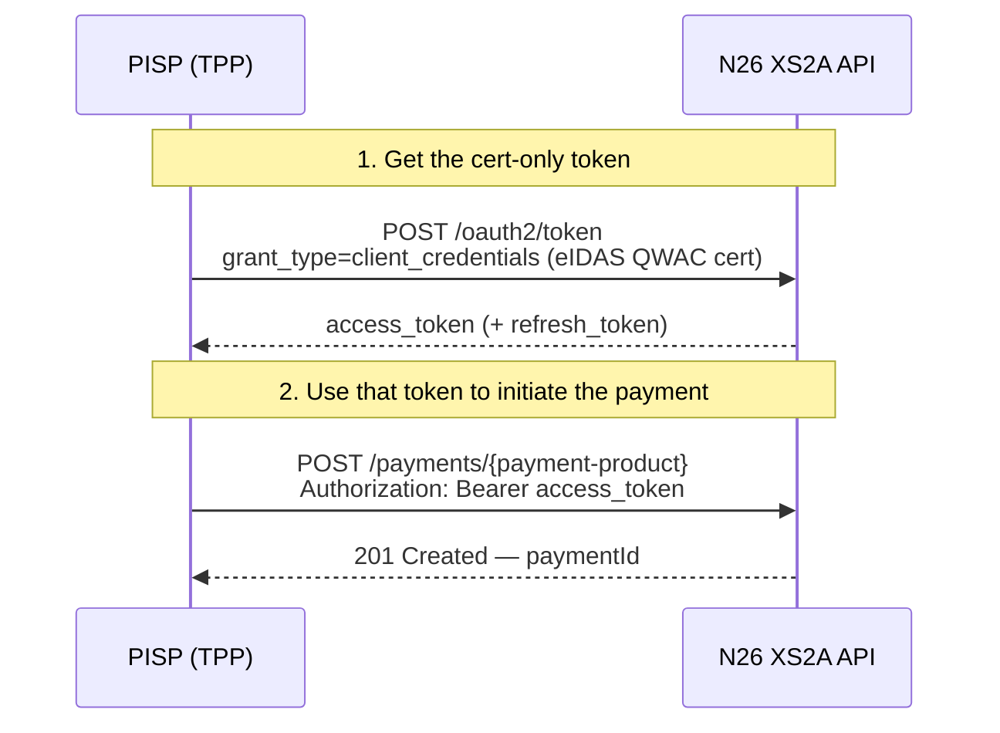
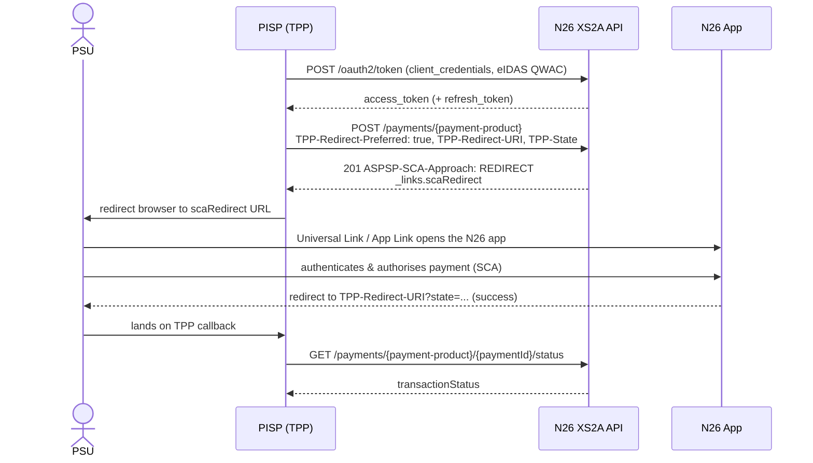

# N26 - PSD2 Dedicated Interface - PISP Access documentation

> :information_source: This document describes the **Redirect (App-to-App)** SCA approach for the N26
> PSD2 Dedicated Interface PISP flow. The TPP obtains a single cert-only access token, initiates the
> payment with the `TPP-Redirect-Preferred: true` header, and redirects the PSU to the N26 app to
> authenticate. The PSU authorises directly in the N26 mobile app (App-to-App via a Universal Link /
> App Link) — or, when the app is not installed, on an N26 web page — and is then redirected back to
> the TPP.

1. [General information](./dedicated-pisp.md#general-information)
2. [Access & Identification of TPP](./dedicated-pisp.md#access--identification-of-tpp)
3. [Support for this implementation on the Berlin Group API](./dedicated-pisp.md#support-for-this-implementation-on-the-berlin-group-api)
4. [OAuth as a Pre-step](./dedicated-pisp.md#oauth-as-a-pre-step)
5. [Authentication endpoints](./dedicated-pisp.md#authentication-endpoints)
6. [Payment endpoints](./dedicated-pisp.md#payment-endpoints)
    1. [SEPA Credit Transfers](./dedicated-pisp.md#sepa-credit-transfers)
    2. [Instant SEPA Credit Transfers](./dedicated-pisp.md#instant-sepa-credit-transfers)
    3. [Periodic Payments](./dedicated-pisp.md#periodic-payments)
7. [Redirect SCA flow](./dedicated-pisp.md#redirect-sca-flow)
8. [Error scenarios](./dedicated-pisp.md#error-scenarios)

## General information

Berlin Group Conformity : [Implementation Guidelines version 1.3.6](https://www.berlin-group.org/nextgenpsd2-downloads "https://www.berlin-group.org/nextgenpsd2-downloads")

Authorisation protocol: [oAuth 2.0](https://oauth.net/2/ "https://oauth.net/2/")

Security layer: A valid QWAC Certificate for PSD2 is required to access the Berlin Group API, and should be included in every request. The official list of QTSP is available on the [European Comission eIDAS Trusted List](https://webgate.ec.europa.eu/tl-browser/##/ "https://webgate.ec.europa.eu/tl-browser/##/"). For the N26 PSD2 Dedicated Interface API, the QWAC Certificate must be issued from a production certificate authority.

> :information_source: Certificates can be renewed by making an API call **using the new certificate**, which will then
> be onboarded automatically.

## Access & Identification of TPP

### Base URL

`https://xs2a.tech26.de`

### Sandbox URL

`https://xs2a.tech26.de/sandbox`

### On-boarding of new TPPs

1. A TPP shall connect to the N26 PSD2 dedicated API by using an eIDAS valid certificate (QWAC) issued
2. N26 shall check the QWAC certificate in an automated way and allow the TPP to identify themselves  with the subsequent API calls
3. As the result of the steps above, the TPP should be able to continue using the API without manual involvement from the N26 side

## Support for this implementation on the Berlin Group API

| **Service**                  | **Support**                                                        |
| ---------------------------- | ------------------------------------------------------------------ |
| Supported SCA Approaches     | Redirect / App-to-App (OAuth2 client_credentials pre-step)         |
| SCA Validity                 | 20 minutes                                                         |
| Redirect SCA completion timeout | 10 minutes                                                      |
| Supported payment schemes    | SEPA Credit Transfers, Instant SEPA Transfers                      |
| Support of Periodic payments | Supported                                                          |
| Support of Bulk payments     | Not Supported                                                      |
| fundsAvailable               | Not Supported                                                      |
| App to app redirection       | Supported                                                          |

## OAuth as a Pre-step

OAuth2 is supported by this API through a cert-only **`client_credentials`** grant. The TPP obtains a
single access token by calling `POST /oauth2/token` over an mTLS connection presenting its eIDAS QWAC
certificate — there is **no** browser-based PSU login, **no** authorization code, and **no** token
exchange step. N26 derives the TPP's `client_id` from the certificate.

The PSU is authenticated later, directly inside the N26 app, during the Redirect SCA step (see
[Redirect SCA flow](#redirect-sca-flow)).

> :information_source: Each access token is bound to **exactly one resource** — a single
> payment. The same token cannot be reused to initiate a second payment.



### Validity of access & refresh tokens

|                | **Access Token**                        | **Refresh Token**                                                         |
| -------------- | --------------------------------------- | ------------------------------------------------------------------------- |
| **Purpose**    | Access for API calls in **one session** | Generate new access tokens                                                |
| **How to get** | Call `POST /oauth2/token` with `grant_type=client_credentials` over mTLS with your eIDAS QWAC certificate. No PSU login or authorization code is required. | Existing refresh token |
| **Validity**   | 15 min                                  | **One time usable**, but chain of refresh tokens is **valid for 40 days** |
| **Storage**    | NEVER                                   | Yes (expiry needs to be stored on TPP)                                    |

> :information_source: **Refreshing refresh tokens**
> The first refresh token has validity of 40 days, but is **one-time usable**.
> With this refresh token, a new set of an access token and a refresh token can be requested.
> This new refresh token will maintain the initial 40 days validity.
> So, in summary, the chain of refresh tokens has a validity of 40 days.

> :information_source: **Refresh token getting close to expiry**
> On day 39 the TPP should discard the refresh token and ask users for re-authentication.
> As highlighted above, the TPP should never store users' passwords.

> :warning: Access tokens are supposed to be used only for **1 session (sequence of calls)**.
> If users request a manual refresh, a new access token has to be requested **EVEN** if the original access token is still valid.
> For this reason the TPP should **NEVER** store the access token.

> :warning: The TPP should not use those access and refresh tokens on base URLs other than `xs2a.tech26.de`. Access tokens issued for PISP cannot be used for AISP flows.

## Authentication endpoints

These endpoints are used to retrieve an access token for use with the /payments endpoints.

Note: any values shown between curly braces should be taken as variables, while the ones not surrounded are to be read
as literals.

### Obtain an access token

The TPP obtains a cert-only `client_credentials` access token bound to its eIDAS QWAC certificate. This single token is used to initiate one payment and to call the related payment endpoints after SCA — no PSU login and no authorization code exchange take place.

#### Sample Request

```
POST    /oauth2/token?role=DEDICATED_PISP HTTP/1.1
Content-Type: application/x-www-form-urlencoded
(mTLS connection presenting the eIDAS QWAC certificate)

grant_type=client_credentials
```

Supported query parameters:

| **Name of query parameter** | **Description**                                                                    |
| --------------------------- | ---------------------------------------------------------------------------------- |
| role                        | Accepted value: "`DEDICATED_PISP`" to generate a PISP-only token. Mandatory field. |

Supported form parameters:

| **Name of parameter** | **Description**                                             |
| --------------------- | ----------------------------------------------------------- |
| grant_type            | Accepted value: "client_credentials". Mandatory parameter. |

#### Response

##### Successful

The token response also includes a `refresh_token` (see [Refresh Token](#refresh-token)).

```
HTTP/1.1 200 OK
{
    "access_token": "{{access_token}}",
    "token_type": "bearer",
    "refresh_token": "{{refresh_token}}",
    "expires_in": {{expires_in_seconds}}
}
```

##### Unsuccessful

```
HTTP/1.1 400 Bad Request
{
    "error": "invalid_request"
}
```

### Refresh Token

When an access_token has expired, a TPP can request a new one by making use of the refresh token request, which will invalidate the token used for this request and generate a new pair of access_token and refresh_token.

#### Request

```
POST    /oauth2/token?role=DEDICATED_PISP HTTP/1.1
Content-Type: application/x-www-form-urlencoded

grant_type=refresh_token&
refresh_token={{refresh_token}}
```

Supported form parameters:

| **Name of parameter** | **Description**                                                               |
| --------------------- | ----------------------------------------------------------------------------- |
| grant_type            | Accepted value: "refresh_token". Mandatory parameter.                         |
| refresh_token         | The refresh token from the last POST /oauth2/token call. Mandatory parameter. |

#### Response

```
HTTP/1.1 200 OK
{
    "access_token": "{{access_token}}",
    "token_type": "bearer",
    "refresh_token": "{{refresh_token}}",
    "expires_in": {{expires_in_seconds}}
}
```

## Payment endpoints

### SEPA Credit Transfers

#### Initiate SEPA Credit Transfer

To request the Redirect (App-to-App) SCA approach, send the following headers with the payment-initiation request:

| **Header**             | **Description**                                                                                                    |
| ---------------------- | ----------------------------------------------------------------------------------------------------------------- |
| TPP-Redirect-Preferred | Must be set to `true` to select the Redirect SCA approach. Mandatory for this flow.                               |
| TPP-Redirect-URI       | The URI N26 redirects the PSU back to after SCA. Mandatory when `TPP-Redirect-Preferred=true`.                    |
| TPP-State              | Opaque value echoed back on the redirect callback so the TPP can correlate the response. Optional but recommended. |

> :warning: If `TPP-Redirect-Preferred` is `true` but `TPP-Redirect-URI` is missing or malformed, the
> request is rejected with `400 Bad Request` and a `FORMAT_ERROR` message.

> :information_source: Please note that the **debtorAccount** parameter is not mandatory. If it is
> excluded, the debtor account is left unset (`null`) and the PSU selects the account to pay from
> directly in the N26 app during the Redirect SCA. The payment is executed against the account the
> PSU selects.

##### Request

```
POST    /v1/berlin-group/v1/payments/sepa-credit-transfers HTTP/1.1
Authorization: bearer {{access_token}}
X-Request-ID: {{Unique UUID}}
Content-Type: application/json
TPP-Redirect-Preferred: true
TPP-Redirect-URI: https://tpp.com/redirect
TPP-State: 1fL1nn7m9a

{
    "instructedAmount": {
        "currency": "EUR", 
        "amount": "123.50"
    },
    "debtorAccount": {
        "iban": "DE40100100103307118608"
    },
    "creditorName": "Seller",
    "creditorAccount": {
        "iban": "DE02100100109307118603"
    },
    "remittanceInformationUnstructured": "Reference text"
}
```

> :warning: Allowed special characters in remittanceInformationUnstructured for N26 SEPA CT are: -():,.+?&"'/\

###### Response

```
HTTP/1.1 201 Created
ASPSP-SCA-Approach: REDIRECT

{
    "transactionStatus": "RCVD",
    "paymentId": "fe9564bc-02d6-4822-ac5f-a294ee70cc55",
    "_links": {
        "scaRedirect": {
            "href": "https://app.n26.com/wl/open-banking/pisp/sepa?paymentId=fe9564bc-02d6-4822-ac5f-a294ee70cc55"
        },
        "status": {
            "href": "/v1/berlin-group/v1/payments/sepa-credit-transfers/fe9564bc-02d6-4822-ac5f-a294ee70cc55/status"
        },
        "self": {
            "href": "/v1/berlin-group/v1/payments/sepa-credit-transfers/fe9564bc-02d6-4822-ac5f-a294ee70cc55"
        },
        "scaStatus": {
            "href": "/v1/berlin-group/v1/payments/sepa-credit-transfers/fe9564bc-02d6-4822-ac5f-a294ee70cc55/authorisations/711df249-058c-4305-a5e7-e116b7efd480"
        }
    }
}
```

#### Get payment status

This endpoint is intended to be polled by the TPP to determine whether the users have confirmed the payment in the N26 app.

Statuses currently supported:

| **Status code** | **Description**                                                                                                                                                       |
| ----------------- | ----------------------------------------------------------------------------------------------------------------------------------------------------------------------- |
| RCVD            | Received. Initial status for a payment. A certification has been sent to the user’s app.|
| ACCP            | AcceptedCustomerProfile. User has confirmed the in-app certification and the payment has been successfully initiated. |                   _
| ACFC            | AcceptedFundsChecked. User has enough funds to perform a payment, and a hold has been applied on the funds.|
| ACSC            | AcceptedSettlementCompleted. Payment execution process has been successfully completed by N26. This is **NOT** a confirmation that the beneficiary has received the funds.|
| RJCT            | Rejected. Payment failed to be initiated or executed.| 

The final status of a payment is either **ACSC** or **RJCT**.

:warning: Please note that the final status `ACSC` is only applied after reconciliation from BundesBank which, in most cases, takes place **at the end of the day**. Until then, the payment may stay in the intermediate status `ACFC`. 

##### Request

```
GET    /v1/berlin-group/v1/payments/sepa-credit-transfers/{{paymentId}}/status HTTP/1.1
Authorization: bearer {{access_token}}
X-Request-ID: {{Unique UUID}}
```

> ℹ️ This endpoint should not be polled more than **one time per second**. After a terminal status is reached (`RJCT`; `ACSC`), the polling should stop.


##### Response

```
HTTP/1.1 200 OK
{
    "transactionStatus": "ACSC",
    "tppMessages": []
}
```

```
HTTP/1.1 200 OK
{
    "transactionStatus": "RJCT",
    "tppMessages": [
        {
            "category": "ERROR",
            "code": "FUNDS_NOT_AVAILABLE",
            "text": "Insufficient available balance or configured limits prevented execution after initial acceptance."
        }
    ]
}
```

> ℹ️ The response will contain a non-emtpy list of `tppMessages` only when `transactionStatus` is `RJCT`. The category will in this case always be `ERROR` and the code will take one of the following values: `FUNDS_NOT_AVAILABLE`, `CONTENT_INVALID`.

#### Get payment details

##### Request

```
GET    /v1/berlin-group/v1/payments/sepa-credit-transfers/{{paymentId}} HTTP/1.1
Authorization: bearer {{access_token}}
X-Request-ID: {{Unique UUID}}
```

##### Response
1) If "debtorAccount" is selected
```
HTTP/1.1 200 OK
{
  "debtorAccount": {
       "iban": "DE40100100103307118608"
  },
  "debtorName": "Buyer",
  "instructedAmount": {
       "amount":  0.12,
       "currency":  "EUR"
  },
  "creditorAccount":  {
       "iban": "DE96100110012627266269"
  },
  "creditorName": "Seller",
  "remittanceInformationUnstructured": "reference text",
  "transactionStatus": "ACCP",
  "tppMessages": []
}
```


2) If "debtorAccount" is not selected
```
HTTP/1.1 200 OK
{
  "debtorAccount": null,
  "debtorName": "Buyer",
  "instructedAmount": {
       "amount":  0.12,
       "currency":  "EUR"
  },
  "creditorAccount":  {
       "iban": "DE96100110012627266269"
  },
  "creditorName": "Seller",
  "remittanceInformationUnstructured": "reference text",
  "transactionStatus": "ACCP",
  "tppMessages": []
}
```
> ℹ️ The response will contain a non-emtpy list of `tppMessages` only when `transactionStatus` is `RJCT`. The category will in this case always be `ERROR` and the code will take one of the following values: `FUNDS_NOT_AVAILABLE`, `CONTENT_INVALID`.
```
{
   ...
   "tppMessages": [
      {
         "category": "ERROR",
         "code": "FUNDS_NOT_AVAILABLE",
         "text": "Insufficient available balance or configured limits prevented execution after initial acceptance."
      }
   ]
}
```

#### Get list of authorisation IDs

##### Request

```
GET    /v1/berlin-group/v1/payments/sepa-credit-transfers/{{paymentId}}/authorisations HTTP/1.1
Authorization: bearer {{access_token}}
X-Request-ID: {{Unique UUID}}
```

##### Response

```
HTTP/1.1 200 OK
{
    "authorisationIds": [
        "e93bf74e-9444-4a5e-8524-648d80848126"
    ]
}
```

#### Get scaStatus of authorisation

##### Request

```
GET    /v1/berlin-group/v1/payments/sepa-credit-transfers/{{paymentId}}/authorisations/{{authorisationId}} HTTP/1.1
Authorization: bearer {{access_token}}
X-Request-ID: {{Unique UUID}}
```
>ℹ️ This endpoint should not be polled more than **one time per second**. After a terminal status is reached (`FINALISED`; `FAILED`), the polling should stop.


##### Response

```
HTTP/1.1 200 OK
{
    "scaStatus": "finalised"
}
```

### Instant SEPA Credit Transfers

#### Initiate Instant SEPA Credit Transfer

To request the Redirect (App-to-App) SCA approach, send the following headers with the payment-initiation request:

| **Header**             | **Description**                                                                                                    |
| ---------------------- | ----------------------------------------------------------------------------------------------------------------- |
| TPP-Redirect-Preferred | Must be set to `true` to select the Redirect SCA approach. Mandatory for this flow.                               |
| TPP-Redirect-URI       | The URI N26 redirects the PSU back to after SCA. Mandatory when `TPP-Redirect-Preferred=true`.                    |
| TPP-State              | Opaque value echoed back on the redirect callback so the TPP can correlate the response. Optional but recommended. |

> :warning: If `TPP-Redirect-Preferred` is `true` but `TPP-Redirect-URI` is missing or malformed, the
> request is rejected with `400 Bad Request` and a `FORMAT_ERROR` message.

> :information_source: Please note that the **debtorAccount** parameter is not mandatory. If it is
> excluded, the debtor account is left unset (`null`) and the PSU selects the account to pay from
> directly in the N26 app during the Redirect SCA. The payment is executed against the account the
> PSU selects.

##### Request

```
POST    /v1/berlin-group/v1/payments/instant-sepa-credit-transfers HTTP/1.1
Authorization: bearer {{access_token}}
X-Request-ID: {{Unique UUID}}
Content-Type: application/json
TPP-Redirect-Preferred: true
TPP-Redirect-URI: https://tpp.com/redirect
TPP-State: 1fL1nn7m9a

{
    "instructedAmount": {
        "currency": "EUR", 
        "amount": "123.50"
    },
    "debtorAccount": {
        "iban": "DE40100100103307118608"
    },
    "creditorName": "Seller",
    "creditorAccount": {
        "iban": "DE02100100109307118603"
    },
    "remittanceInformationUnstructured": "Reference text"
}
```

> :warning: Allowed special characters in creditorName for N26 SEPA ICT are: -():,.+?/
>
> :warning: Allowed special characters in remittanceInformationUnstructured for N26 SEPA ICT are: -():,.+?&"'/\

##### Response

```
HTTP/1.1 201 Created
ASPSP-SCA-Approach: REDIRECT

{
    "transactionStatus": "RCVD",
    "paymentId": "a4e7c6e3-ef2f-440c-ac0f-36dcafe4551c",
    "_links": {
        "scaRedirect": {
            "href": "https://app.n26.com/wl/open-banking/pisp/sepa-ict?paymentId=a4e7c6e3-ef2f-440c-ac0f-36dcafe4551c"
        },
        "status": {
            "href": "/v1/berlin-group/v1/payments/instant-sepa-credit-transfers/fe9564bc-02d6-4822-ac5f-a294ee70cc55/status"
        },
        "self": {
            "href": "/v1/berlin-group/v1/payments/instant-sepa-credit-transfers/fe9564bc-02d6-4822-ac5f-a294ee70cc55"
        },
        "scaStatus": {
            "href": "/v1/berlin-group/v1/payments/instant-sepa-credit-transfers/fe9564bc-02d6-4822-ac5f-a294ee70cc55/authorisations/711df249-058c-4305-a5e7-e116b7efd480"
        }
    }
}
```

#### Get payment status

This endpoint is intended to be polled by the TPP to determine whether the users have confirmed the payment in the N26 app.

Payment final status will be applied no later then **15 minutes**.

Statuses currently supported:

| **Status code** | **Description**                                                                                                                                                       |
| ----------------- | ----------------------------------------------------------------------------------------------------------------------------------------------------------------------- |
| RCVD            | Received. Initial status for a payment. A certification has been sent to the user’s app.|
| ACCP            | AcceptedCustomerProfile. User has confirmed the in-app certification and the payment has been successfully initiated. |                   _
| ACFC            | AcceptedFundsChecked. User has enough funds to perform a payment, and a hold has been applied on the funds.|
| ACCC            | AcceptedSettlementCompleted. The payment has been successfully processed and the funds have been credited to the creditor's account.|
| RJCT            | Rejected. Payment failed to be initiated or executed.| 

The final status of a payment is either **ACCC** or **RJCT**.   

##### Request

```
GET    /v1/berlin-group/v1/payments/instant-sepa-credit-transfers/{{paymentId}}/status HTTP/1.1
Authorization: bearer {{access_token}}
X-Request-ID: {{Unique UUID}}
```

> ℹ️ This endpoint should not be polled more than **one time per second**. After a terminal status is reached (`RJCT`; `ACCC`), the polling should stop.


###### Response

```
HTTP/1.1 200 OK
{
    "transactionStatus": "ACCC",
    "tppMessages": []
}
```

```
HTTP/1.1 200 OK
{
    "transactionStatus": "RJCT",
    "tppMessages": [
        {
            "category": "ERROR",
            "code": "FUNDS_NOT_AVAILABLE",
            "text": "Insufficient available balance or configured limits prevented execution after initial acceptance."
        }
    ]
}
```

> ℹ️ The response will contain a non-emtpy list of `tppMessages` only when `transactionStatus` is `RJCT`. The category will in this case always be `ERROR` and the code will take one of the following values: `FUNDS_NOT_AVAILABLE`, `CONTENT_INVALID`.

#### Get payment details

##### Request

```
GET    /v1/berlin-group/v1/payments/instant-sepa-credit-transfers/{{paymentId}} HTTP/1.1
Authorization: bearer {{access_token}}
X-Request-ID: {{Unique UUID}}
```

##### Response

1) If "debtorAccount" is selected
```
HTTP/1.1 200 OK
{
  "debtorAccount": {
       "iban": "DE40100100103307118608"
  },
  "debtorName": "Buyer",
  "instructedAmount": {
       "amount":  0.12,
       "currency":  "EUR"
  },
  "creditorAccount":  {
       "iban": "DE96100110012627266269"
  },
  "creditorName": "Seller",
  "remittanceInformationUnstructured": "reference text",
  "transactionStatus": "ACCP",
  "tppMessages": []
}
```

2) If "debtorAccount" is not selected
```
HTTP/1.1 200 OK
{
  "debtorAccount": null,
  "debtorName": "Buyer",
  "instructedAmount": {
       "amount":  0.12,
       "currency":  "EUR"
  },
  "creditorAccount":  {
       "iban": "DE96100110012627266269"
  },
  "creditorName": "Seller",
  "remittanceInformationUnstructured": "reference text",
  "transactionStatus": "ACCP",
  "tppMessages": []
}
```
> ℹ️ The response will contain a non-emtpy list of `tppMessages` only when `transactionStatus` is `RJCT`. The category will in this case always be `ERROR` and the code will take one of the following values: `FUNDS_NOT_AVAILABLE`, `CONTENT_INVALID`.
```
{
   ...
   "tppMessages": [
      {
         "category": "ERROR",
         "code": "FUNDS_NOT_AVAILABLE",
         "text": "Insufficient available balance or configured limits prevented execution after initial acceptance."
      }
   ]
}
```

#### Get list of authorisation IDs

##### Request

```
GET    /v1/berlin-group/v1/payments/instant-sepa-credit-transfers/{{paymentId}}/authorisations HTTP/1.1
Authorization: bearer {{access_token}}
X-Request-ID: {{Unique UUID}}
```

##### Response

```
HTTP/1.1 200 OK
{
    "authorisationIds": [
        "e93bf74e-9444-4a5e-8524-648d80848126"
    ]
}
```

#### Get scaStatus of authorisation

##### Request

```
GET    /v1/berlin-group/v1/payments/instant-sepa-credit-transfers/{{paymentId}}/authorisations/{{authorisationId}} HTTP/1.1
Authorization: bearer {{access_token}}
X-Request-ID: {{Unique UUID}}
```

>ℹ️ This endpoint should not be polled more than **one time per second**. After a terminal status is reached (`FINALISED`; `FAILED`), the polling should stop.


##### Response

```
HTTP/1.1 200 OK
{
    "scaStatus": "finalised"
}
```

### Periodic Payments

#### Initiate Periodic Payment

To request the Redirect (App-to-App) SCA approach, send the following headers with the payment-initiation request:

| **Header**             | **Description**                                                                                                    |
| ---------------------- | ----------------------------------------------------------------------------------------------------------------- |
| TPP-Redirect-Preferred | Must be set to `true` to select the Redirect SCA approach. Mandatory for this flow.                               |
| TPP-Redirect-URI       | The URI N26 redirects the PSU back to after SCA. Mandatory when `TPP-Redirect-Preferred=true`.                    |
| TPP-State              | Opaque value echoed back on the redirect callback so the TPP can correlate the response. Optional but recommended. |

> :warning: If `TPP-Redirect-Preferred` is `true` but `TPP-Redirect-URI` is missing or malformed, the
> request is rejected with `400 Bad Request` and a `FORMAT_ERROR` message.

> :information_source: Please note that the **debtorAccount** parameter is not mandatory. If it is
> excluded, the debtor account is left unset (`null`) and the PSU selects the account to pay from
> directly in the N26 app during the Redirect SCA. The periodic payment is executed against the
> account the PSU selects.

##### Request

```
POST    /v1/berlin-group/v1/periodic-payments/sepa-credit-transfers HTTP/1.1
Authorization: bearer {{access_token}}
X-Request-ID: {{Unique UUID}}
Content-Type: application/json
TPP-Redirect-Preferred: true
TPP-Redirect-URI: https://tpp.com/redirect
TPP-State: 1fL1nn7m9a

{
    "debtorAccount": {
        "iban": "DE40100100103307118608"
    },
    "instructedAmount": {
        "currency": "EUR", 
        "amount": "123.50"
    },
    "creditorAccount": 
    {
       "iban": "DE73500105175658455178"
    },
    "creditorName": "Seller",
    "remittanceInformationUnstructured": "Reference text",
    "startDate": "2023-01-30",
    "endDate": "2024-01-30"
    "frequency": "WEEK"
}
```

| **Name of parameter** | **Type** | **Usage** |
|-----------------------|---------|-----------|
| startDate             | ISODate | Mandatory |
| endDate               | ISODate | Optional  |
| frequency             | FrequencyCode | Mandatory |

- Supported frequency codes: `WEEK`, `MNTH`, `QUTR`, `SEMI`, `YEAR`.
- The `startDate` cannot be in the past, or more than a year in the future.

> :warning: Allowed special characters in creditorName for N26 SEPA CT are: -():,.+?/
>
> :warning: Allowed special characters in remittanceInformationUnstructured for N26 SEPA CT are: -():,.+?&"'/\

##### Response

```
HTTP/1.1 201 Created
ASPSP-SCA-Approach: REDIRECT

{
    "transactionStatus": "RCVD",
    "paymentId": "ead303f5-8404-4b1d-96ae-167d402bbd69",
    "_links": {
        "scaRedirect": {
            "href": "https://app.n26.com/wl/open-banking/pisp/periodic?paymentId=ead303f5-8404-4b1d-96ae-167d402bbd69"
        },
        "self": {
            "href": "/v1/berlin-group/v1/periodic-payments/sepa-credit-transfers/ead303f5-8404-4b1d-96ae-167d402bbd69"
        },
        "status": {
            "href": "/v1/berlin-group/v1/periodic-payments/sepa-credit-transfers/ead303f5-8404-4b1d-96ae-167d402bbd69/status"
        },
        "scaStatus": {
            "href": "/v1/berlin-group/v1/periodic-payments/sepa-credit-transfers/ead303f5-8404-4b1d-96ae-167d402bbd69/authorisations/ce172bad-18b8-47cb-9ac5-31b73f320c32"
        }
    }
}
```

#### Get status of periodic payment

This endpoint provides statuses on both the creation and deletion of periodic payments. The statuses provide information on the rule itself, and not the 
subsequent execution of payments. Once the rule has been successfully created, the final status would be "ACCP". Once the rule has been successfully deleted, 
the final status would be "CANC". 

As users are required to provide confirmation for both the creation and deletion of periodic payments, this endpoint is intended to be polled by the TPP.

Statuses currently supported:

| **Status code** | **Description**                                                                                                                                                       |
| ----------------- | ----------------------------------------------------------------------------------------------------------------------------------------------------------------------- |
| RCVD            | Received. Initial status for creating a periodic payment. A certification has been sent to the user’s app.                                                                              |
| ACCP            | AcceptedCustomerProfile. User has confirmed the in-app certification to create a periodic payment, and the periodic payment has been successfully created. |
| RJCT            | Rejected. Status for payment when an in-app certification to **create** a periodic payment expired or was denied by the user.                                                                          |
| CANC            | Cancelled. User has confirmed the in-app certification to **delete** a periodic payment, and the periodic payment has been successfully deleted.                                                                             |
> :warning: When a periodic payment is being deleted, the status will only change from ACCP to CANC once the in-app certification to **delete** the periodic payment 
> has been confirmed by the user. If the in-app certification expires or is denied by the user, the status will remain ACCP.

##### Request

```
GET    /v1/berlin-group/v1/periodic-payments/sepa-credit-transfers/{{paymentId}}/status HTTP/1.1
Authorization: bearer {{access_token}}
X-Request-ID: {{Unique UUID}}
```

> ℹ️ This endpoint should not be polled more than **one time per second**. After a terminal status is reached (`RJCT`; `ACCP`; `CANC`), the polling should stop.


##### Response

```
HTTP/1.1 200 OK
{
    "transactionStatus": "ACCP"
}
```

#### Get periodic payment details

##### Request

```
GET    /v1/berlin-group/v1/periodic-payments/sepa-credit-transfers/{{paymentId}} HTTP/1.1
Authorization: bearer {{access_token}}
X-Request-ID: {{Unique UUID}}
```

##### Response

1) If "debtorAccount" is selected
```
HTTP/1.1 200 OK
{
  "debtorAccount": {
       "iban": "DE40100100103307118608"
  },
  "debtorName": "Buyer",
  "instructedAmount": {
       "amount":  0.12,
       "currency":  "EUR"
  },
  "creditorAccount":  {
       "iban": "DE96100110012627266269"
  },
  "creditorName": "Seller",
  "remittanceInformationUnstructured": "reference text",
  "transactionStatus": "ACCP",
  "startDate": "2023-01-30",
  "endDate": "2024-01-30",
  "frequency": "WEEK"
}
```

2) If "debtorAccount" is not selected
```
HTTP/1.1 200 OK
{
  "debtorAccount": null,
  "debtorName": "Buyer",
  "instructedAmount": {
       "amount":  0.12,
       "currency":  "EUR"
  },
  "creditorAccount":  {
       "iban": "DE96100110012627266269"
  },
  "creditorName": "Seller",
  "remittanceInformationUnstructured": "reference text",
  "transactionStatus": "ACCP",
  "startDate": "2023-01-30",
  "endDate": "2024-01-30",
  "frequency": "WEEK"
}
```

#### Get list of authorisation IDs

##### Request

```
GET    /v1/berlin-group/v1/payments/periodic-payments/sepa-credit-transfers/{{paymentId}}/authorisations HTTP/1.1
Authorization: bearer {{access_token}}
X-Request-ID: {{Unique UUID}}
```

##### Response

```
HTTP/1.1 200 OK
{
    "authorisationIds": [
        "e93bf74e-9444-4a5e-8524-648d80848126"
    ]
}
```

#### Get authorisation

##### Request

```
GET    /v1/berlin-group/v1/payments/periodic-payments/sepa-credit-transfers/{{paymentId}}/authorisations/{{authorisationId}} HTTP/1.1
Authorization: bearer {{access_token}}
X-Request-ID: {{Unique UUID}}
```

>ℹ️ This endpoint should not be polled more than **one time per second**. After a terminal status is reached (`FINALISED`; `FAILED`), the polling should stop.


##### Response

```
HTTP/1.1 200 OK
{
    "scaStatus": "finalised"
}
```

#### Delete periodic payment

##### Request

```
DELETE    /v1/berlin-group/v1/periodic-payments/sepa-credit-transfers/{{paymentId}} HTTP/1.1
Authorization: bearer {{access_token}}
X-Request-ID: {{Unique UUID}}
```

##### Response

```
HTTP/1.1 202 Accepted
{
    "transactionStatus": "ACCP",
    "paymentId": "ead303f5-8404-4b1d-96ae-167d402bbd69",
    "_links": {
        "self": {
            "href": "/v1/berlin-group/v1/periodic-payments/sepa-credit-transfers/ead303f5-8404-4b1d-96ae-167d402bbd69"
        },
        "status": {
            "href": "/v1/berlin-group/v1/periodic-payments/sepa-credit-transfers/ead303f5-8404-4b1d-96ae-167d402bbd69/status"
        },
        "scaStatus": {
            "href": "/v1/berlin-group/v1/periodic-payments/sepa-credit-transfers/ead303f5-8404-4b1d-96ae-167d402bbd69/authorisations/ce172bad-18b8-47cb-9ac5-31b73f320c32"
        }
    }
}
```

##### Error Response

```
HTTP/1.1 400 Bad Request
{
    "title": "Resource Blocked.",
    "code": "RESOURCE_BLOCKED",
    "detail": "There's a change already pending for this periodic payment."
}
```

#### Get list of cancellation authorisation IDs

This endpoint is currently not supported.

#### Get scaStatus of cancellation authorisation

This endpoint is currently not supported.

## Redirect SCA flow

With the Redirect (App-to-App) SCA approach the PSU authenticates directly in the N26 app instead of
confirming an out-of-band push notification. The end-to-end sequence is:



1. The TPP obtains a cert-only `client_credentials` access token (see
   [Obtain an access token](#obtain-an-access-token)).
2. The TPP initiates the payment with the `TPP-Redirect-Preferred: true`, `TPP-Redirect-URI` and
   (optionally) `TPP-State` headers.
3. N26 responds with `ASPSP-SCA-Approach: REDIRECT` and a `scaRedirect` entry in the `_links` object.
4. The TPP redirects the PSU's browser to the `scaRedirect` URL.
5. The `scaRedirect` URL is a Universal Link (iOS) / App Link (Android). If the N26 app is installed it
   opens directly (App-to-App); otherwise the PSU continues on an N26 web page.
6. The PSU authenticates and authorises the payment inside the N26 app.
7. N26 redirects the PSU back to the TPP's `TPP-Redirect-URI`:
   - On success: `TPP-Redirect-URI?state=<TPP-State>` (the `state` parameter is omitted if no
     `TPP-State` was provided).
   - On failure: `TPP-Redirect-URI?error=access_denied&state=<TPP-State>`.
8. The TPP can then poll the payment status / `scaStatus` and continue once the payment reaches a
   terminal status.

> :warning: **The PSU must complete the Redirect SCA within 10 minutes.** If the payment is not
> authorised within this window, N26 rejects it so it is never left pending: the `transactionStatus`
> becomes `RJCT` (Rejected) and the `scaStatus` becomes `failed`. The TPP must then initiate a new
> payment to start a fresh SCA.

The `scaRedirect` base URL depends on the environment and payment type. Staging uses the same paths
with the `https://app.staging-n26.com` base URL.

| **Payment type**             | **Production scaRedirect URL**                                               |
| ---------------------------- | ---------------------------------------------------------------------------- |
| SEPA Credit Transfer         | `https://app.n26.com/wl/open-banking/pisp/sepa?paymentId={{paymentId}}`      |
| SEPA Instant Credit Transfer | `https://app.n26.com/wl/open-banking/pisp/sepa-ict?paymentId={{paymentId}}`  |
| Periodic payment             | `https://app.n26.com/wl/open-banking/pisp/periodic?paymentId={{paymentId}}`  |

## Error scenarios

When the SCA cannot be completed, N26 redirects the PSU back to the `TPP-Redirect-URI` with an `error`
query parameter instead of a success response. The following parameters may be present on the callback:

| **Query parameter** | **Description**                                                                                     |
| ------------------- | --------------------------------------------------------------------------------------------------- |
| error               | Present only on failure. `access_denied` (the PSU declined or did not complete SCA) or `server_error` (an unexpected error occurred on the N26 side). |
| state               | The value provided in the `TPP-State` header on payment initiation, echoed back so the TPP can correlate the callback. Omitted if no `TPP-State` was sent. |

Example failure callback:

```
GET https://tpp.com/redirect?error=access_denied&state=1fL1nn7m9a
```

> :information_source: **SCA not completed within 10 minutes.** If the PSU never finishes the SCA,
> the payment is rejected (`transactionStatus: RJCT`, `scaStatus: failed`) and the redirect session
> is closed as a failure (`?error=access_denied`). Poll `GET /payments/{payment-product}/{paymentId}/status`
> to detect the terminal `RJCT` state.
